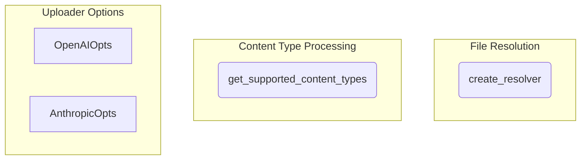

# file_resolution_and_uploads
This module facilitates file content resolution and upload management, including determining supported content types for various providers and configuring file resolvers with provider-specific upload thresholds and options.

<!-- DIAGRAM_JSON
{
  "nodes": [
    {
      "id": "get_supported_content_types",
      "label": "get_supported_content_types",
      "type": "function"
    },
    {
      "id": "create_resolver",
      "label": "create_resolver",
      "type": "function"
    },
    {
      "id": "OpenAIOpts",
      "label": "OpenAIOpts",
      "type": "class"
    },
    {
      "id": "AnthropicOpts",
      "label": "AnthropicOpts",
      "type": "class"
    }
  ],
  "edges": [],
  "groups": [
    {
      "id": "file_resolution",
      "label": "File Resolution",
      "nodes": ["create_resolver"]
    },
    {
      "id": "content_type_processing",
      "label": "Content Type Processing",
      "nodes": ["get_supported_content_types"]
    },
    {
      "id": "uploader_options",
      "label": "Uploader Options",
      "nodes": ["OpenAIOpts", "AnthropicOpts"]
    }
  ]
}
-->
