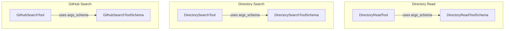

# filesystem_and_code_tools
This module provides tools for interacting with file systems and code repositories, including reading directory contents, semantic searching directories, and semantic searching GitHub repositories.

<!-- DIAGRAM_JSON
{
  "nodes": [
    {
      "id": "DirectoryReadTool",
      "label": "DirectoryReadTool",
      "type": "class"
    },
    {
      "id": "DirectoryReadToolSchema",
      "label": "DirectoryReadToolSchema",
      "type": "class"
    },
    {
      "id": "DirectorySearchTool",
      "label": "DirectorySearchTool",
      "type": "class"
    },
    {
      "id": "DirectorySearchToolSchema",
      "label": "DirectorySearchToolSchema",
      "type": "class"
    },
    {
      "id": "GithubSearchTool",
      "label": "GithubSearchTool",
      "type": "class"
    },
    {
      "id": "GithubSearchToolSchema",
      "label": "GithubSearchToolSchema",
      "type": "class"
    }
  ],
  "edges": [
    {
      "source": "DirectoryReadTool",
      "target": "DirectoryReadToolSchema",
      "label": "uses args_schema",
      "type": "association"
    },
    {
      "source": "DirectorySearchTool",
      "target": "DirectorySearchToolSchema",
      "label": "uses args_schema",
      "type": "association"
    },
    {
      "source": "GithubSearchTool",
      "target": "GithubSearchToolSchema",
      "label": "uses args_schema",
      "type": "association"
    }
  ],
  "groups": [
    {
      "id": "DirectoryRead",
      "label": "Directory Read",
      "members": ["DirectoryReadTool", "DirectoryReadToolSchema"]
    },
    {
      "id": "DirectorySearch",
      "label": "Directory Search",
      "members": ["DirectorySearchTool", "DirectorySearchToolSchema"]
    },
    {
      "id": "GithubSearch",
      "label": "GitHub Search",
      "members": ["GithubSearchTool", "GithubSearchToolSchema"]
    }
  ]
}
-->
