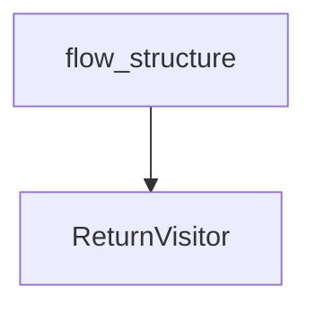

# flow_analysis_and_introspection
This module provides utilities for introspecting and analyzing the structure of CrewAI flows, including class-level definition analysis, instance-level graph traversal, and detailed method code examination.

<!-- DIAGRAM_JSON
{
  "nodes": [
    {"id": "flow_structure", "label": "flow_structure"},
    {"id": "build_ancestor_dict", "label": "build_ancestor_dict"},
    {"id": "calculate_node_levels", "label": "calculate_node_levels"},
    {"id": "count_outgoing_edges", "label": "count_outgoing_edges"},
    {"id": "build_parent_children_dict", "label": "build_parent_children_dict"},
    {"id": "ReturnVisitor", "label": "ReturnVisitor"}
  ],
  "edges": [
    {"source": "flow_structure", "target": "ReturnVisitor", "label": "uses"}
  ]
}
-->
