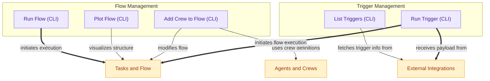

# Flow and Trigger Management CLI
This module provides command-line interface functionalities for managing AI flows, including running, plotting, and adding crews, as well as listing and executing triggers from various integrations.
<!-- DIAGRAM_JSON
{
    "direction": "TD",
    "nodes": [
        {"id": "flow_run_cli", "label": "Run Flow (CLI)", "type": "component", "link": null},
        {"id": "flow_plot_cli", "label": "Plot Flow (CLI)", "type": "component", "link": null},
        {"id": "flow_add_crew_cli", "label": "Add Crew to Flow (CLI)", "type": "component", "link": null},
        {"id": "triggers_list_cli", "label": "List Triggers (CLI)", "type": "component", "link": null},
        {"id": "triggers_run_cli", "label": "Run Trigger (CLI)", "type": "component", "link": null},
        {"id": "flow_module", "label": "Tasks and Flow", "type": "external", "link": "tasks_and_flow.md"},
        {"id": "agents_crews_module", "label": "Agents and Crews", "type": "external", "link": "agents_and_crews.md"},
        {"id": "integrations", "label": "External Integrations", "type": "external", "link": null}
    ],
    "edges": [
        {"source": "flow_run_cli", "target": "flow_module", "label": "initiates execution"},
        {"source": "flow_plot_cli", "target": "flow_module", "label": "visualizes structure"},
        {"source": "flow_add_crew_cli", "target": "flow_module", "label": "modifies flow"},
        {"source": "flow_add_crew_cli", "target": "agents_crews_module", "label": "uses crew definitions"},
        {"source": "triggers_list_cli", "target": "integrations", "label": "fetches trigger info from"},
        {"source": "triggers_run_cli", "target": "integrations", "label": "receives payload from"},
        {"source": "triggers_run_cli", "target": "flow_module", "label": "initiates flow execution"}
    ],
    "groups": [
        {"id": "flow_management_group", "label": "Flow Management", "role": "analytical", "nodes": ["flow_run_cli", "flow_plot_cli", "flow_add_crew_cli"]},
        {"id": "trigger_management_group", "label": "Trigger Management", "role": "analytical", "nodes": ["triggers_list_cli", "triggers_run_cli"]}
    ]
}
-->
