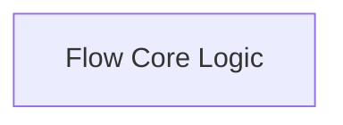

<!-- AUTO_GENERATED_PLACEHOLDER
  reason: LLM did not create .md file for this module
  module_path: crewai_core_framework/tasks_and_flow/flow_core_logic
  component_count: 8
  generated_at: 2026-05-07T03:07:02.958521
-->

# Flow Core Logic

Defines the fundamental structure and meta-programming for creating and managing AI agent collaboration flows.

<!-- DIAGRAM_JSON
{
    "direction": "TD",
    "nodes": [
        {
            "id": "flow_core_logic",
            "label": "Flow Core Logic",
            "type": "module",
            "title": "Flow Core Logic",
            "description": "Defines the fundamental structure and meta-programming for creating and managing AI agent collaboration flows."
        }
    ],
    "edges": [],
    "groups": []
}
-->

