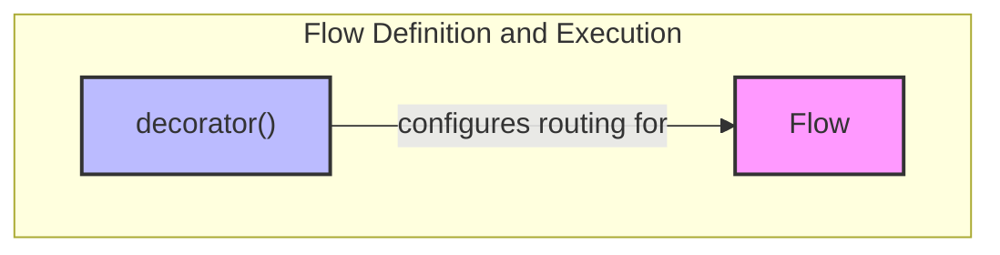

# flow_definition_and_execution
Defines the core `Flow` class for orchestrating multi-step processes and a `decorator` for creating router methods, enabling dynamic flow control.

<!-- DIAGRAM_JSON
{
    "nodes": [
        {
            "id": "Flow",
            "label": "Flow",
            "type": "class"
        },
        {
            "id": "decorator",
            "label": "decorator",
            "type": "function"
        }
    ],
    "edges": [
        {
            "source": "decorator",
            "target": "Flow",
            "label": "configures routing for"
        }
    ],
    "groups": [
        {
            "id": "flow_definition_and_execution",
            "label": "flow_definition_and_execution",
            "nodes": [
                "Flow",
                "decorator"
            ]
        }
    ]
}
-->
