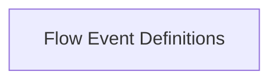

<!-- AUTO_GENERATED_PLACEHOLDER
  reason: LLM did not create .md file for this module
  module_path: crewai_core_framework/tasks_and_flow/flow_visualization_and_events/flow_event_definitions
  component_count: 1
  generated_at: 2026-05-07T03:07:02.958814
-->

# Flow Event Definitions

Defines the event types, such as FlowStartedEvent, that are emitted during the lifecycle and execution of a CrewAI Flow.

<!-- DIAGRAM_JSON
{
    "direction": "TD",
    "nodes": [
        {
            "id": "flow_event_definitions",
            "label": "Flow Event Definitions",
            "type": "module",
            "title": "Flow Event Definitions",
            "description": "Defines the event types, such as FlowStartedEvent, that are emitted during the lifecycle and execution of a CrewAI Flow."
        }
    ],
    "edges": [],
    "groups": []
}
-->

