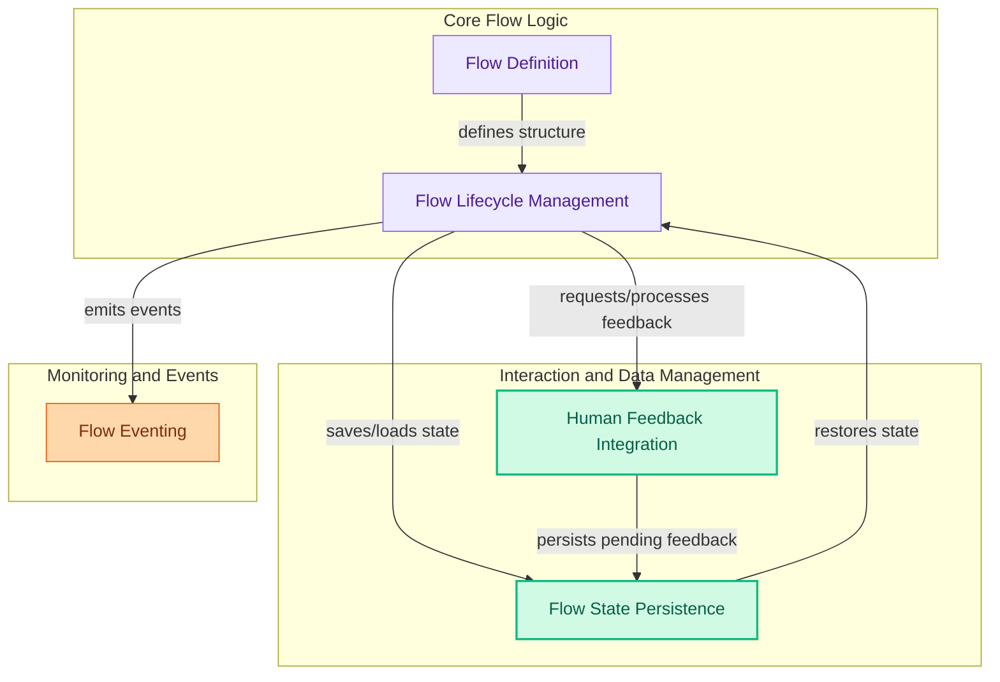

# Flow Execution Module
This module orchestrates the lifecycle and control flow of AI agent crews, handling initialization, state management, asynchronous execution, and integration of human feedback and persistence.

<!-- DIAGRAM_JSON
{
    "direction": "TD",
    "nodes": [
        {"id": "flow_definition", "label": "Flow Definition", "type": "module", "link": "flow_definition.md"},
        {"id": "flow_lifecycle", "label": "Flow Lifecycle Management", "type": "module", "link": "flow_lifecycle.md"},
        {"id": "human_feedback_integration", "label": "Human Feedback Integration", "type": "module", "link": "human_feedback_integration.md"},
        {"id": "flow_state_persistence", "label": "Flow State Persistence", "type": "module", "link": "flow_state_persistence.md"},
        {"id": "flow_eventing", "label": "Flow Eventing", "type": "module", "link": "flow_eventing.md"}
    ],
    "edges": [
        {"source": "flow_definition", "target": "flow_lifecycle", "label": "defines structure"},
        {"source": "flow_lifecycle", "target": "human_feedback_integration", "label": "requests/processes feedback"},
        {"source": "flow_lifecycle", "target": "flow_state_persistence", "label": "saves/loads state"},
        {"source": "flow_lifecycle", "target": "flow_eventing", "label": "emits events"},
        {"source": "human_feedback_integration", "target": "flow_state_persistence", "label": "persists pending feedback"},
        {"source": "flow_state_persistence", "target": "flow_lifecycle", "label": "restores state"}
    ],
    "groups": [
        {"id": "core_flow", "label": "Core Flow Logic", "role": "analytical", "nodes": ["flow_definition", "flow_lifecycle"]},
        {"id": "interaction_data", "label": "Interaction and Data Management", "role": "data", "nodes": ["human_feedback_integration", "flow_state_persistence"]},
        {"id": "monitoring", "label": "Monitoring and Events", "role": "generative", "nodes": ["flow_eventing"]}
    ]
}
-->
