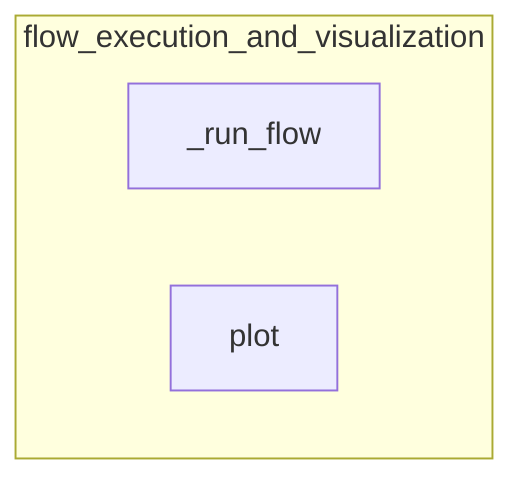

# flow_execution_and_visualization
This module handles the asynchronous execution of flows and provides functionality to visualize their structure as interactive HTML diagrams.

<!-- DIAGRAM_JSON
{
    "nodes": [
        {
            "id": "_run_flow",
            "label": "_run_flow"
        },
        {
            "id": "plot",
            "label": "plot"
        }
    ],
    "edges": [],
    "groups": [
        {
            "id": "flow_execution_and_visualization",
            "label": "flow_execution_and_visualization",
            "nodes": [
                "_run_flow",
                "plot"
            ]
        }
    ]
}
-->
