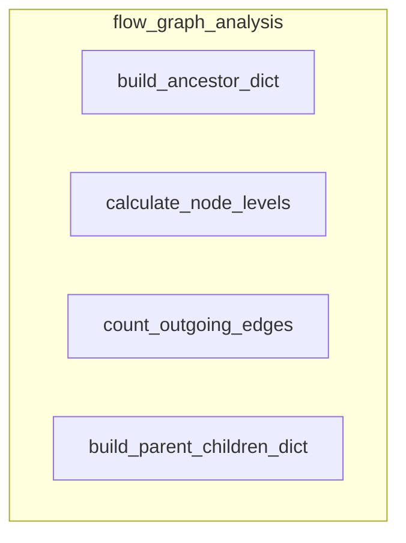

# flow_graph_analysis
This module provides utility functions for analyzing the structure and properties of a flow graph, including hierarchical levels, parent-child relationships, and outgoing edge counts.

<!-- DIAGRAM_JSON
{
  "nodes": [
    {"id": "build_ancestor_dict", "label": "build_ancestor_dict"},
    {"id": "calculate_node_levels", "label": "calculate_node_levels"},
    {"id": "count_outgoing_edges", "label": "count_outgoing_edges"},
    {"id": "build_parent_children_dict", "label": "build_parent_children_dict"}
  ],
  "edges": [],
  "groups": [
    {
      "id": "flow_graph_analysis",
      "label": "flow_graph_analysis",
      "nodes": [
        "build_ancestor_dict",
        "calculate_node_levels",
        "count_outgoing_edges",
        "build_parent_children_dict"
      ]
    }
  ]
}
-->
