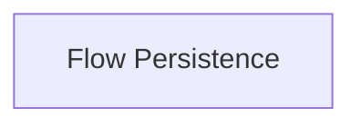

<!-- AUTO_GENERATED_PLACEHOLDER
  reason: LLM did not create .md file for this module
  module_path: crewai_core_framework/tasks_and_flow/flow_persistence
  component_count: 2
  generated_at: 2026-05-07T03:07:02.959538
-->

# Flow Persistence

Manages the saving and loading of flow states for durability and fault tolerance.

<!-- DIAGRAM_JSON
{
    "direction": "TD",
    "nodes": [
        {
            "id": "flow_persistence",
            "label": "Flow Persistence",
            "type": "module",
            "title": "Flow Persistence",
            "description": "Manages the saving and loading of flow states for durability and fault tolerance."
        }
    ],
    "edges": [],
    "groups": []
}
-->

