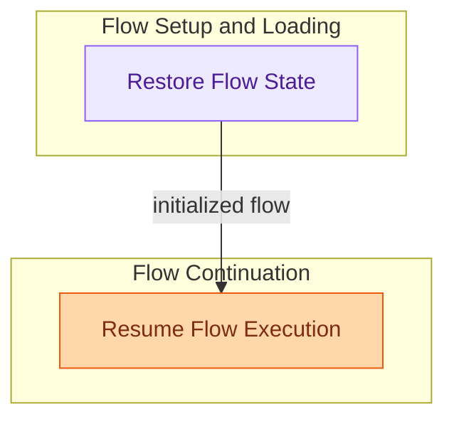

# Flow Resumption and Context Management
This module enables the seamless restoration and continuation of paused workflow executions, processing human feedback and managing the asynchronous context required for resuming operations.

<!-- DIAGRAM_JSON
{
    "direction": "TD",
    "nodes": [
        {"id": "flow_state_restoration", "label": "Restore Flow State", "type": "module", "link": "flow_state_restoration.md"},
        {"id": "flow_execution_resumption", "label": "Resume Flow Execution", "type": "module", "link": "flow_execution_resumption.md"}
    ],
    "edges": [
        {"source": "flow_state_restoration", "target": "flow_execution_resumption", "label": "initialized flow"}
    ],
    "groups": [
        {"id": "flow_setup", "label": "Flow Setup and Loading", "role": "analytical", "nodes": ["flow_state_restoration"]},
        {"id": "flow_continuation", "label": "Flow Continuation", "role": "generative", "nodes": ["flow_execution_resumption"]}
    ]
}
-->
