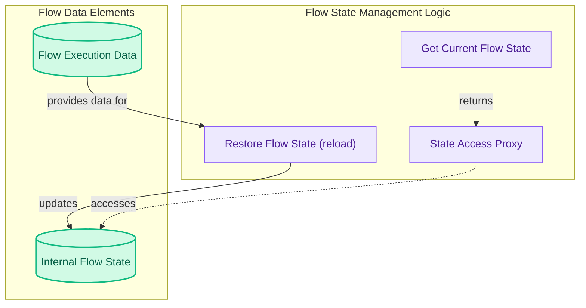

# Flow State Management
This module facilitates the secure management and restoration of a flow's execution state. It offers mechanisms for accessing the current state through a protected proxy and for reloading a flow from historical execution data.

<!-- DIAGRAM_JSON
{
    "direction": "TD",
    "nodes": [
        {
            "id": "get_current_flow_state",
            "label": "Get Current Flow State",
            "type": "component",
            "link": null
        },
        {
            "id": "state_access_proxy",
            "label": "State Access Proxy",
            "type": "component",
            "link": null
        },
        {
            "id": "restore_flow_state",
            "label": "Restore Flow State (reload)",
            "type": "component",
            "link": null
        },
        {
            "id": "flow_execution_data",
            "label": "Flow Execution Data",
            "type": "external",
            "link": null
        },
        {
            "id": "internal_flow_state",
            "label": "Internal Flow State",
            "type": "component",
            "link": null
        }
    ],
    "edges": [
        {
            "source": "get_current_flow_state",
            "target": "state_access_proxy",
            "label": "returns"
        },
        {
            "source": "state_access_proxy",
            "target": "internal_flow_state",
            "label": "accesses"
        },
        {
            "source": "flow_execution_data",
            "target": "restore_flow_state",
            "label": "provides data for"
        },
        {
            "source": "restore_flow_state",
            "target": "internal_flow_state",
            "label": "updates"
        }
    ],
    "groups": [
        {
            "id": "state_management_logic",
            "label": "Flow State Management Logic",
            "role": "analytical",
            "nodes": [
                "get_current_flow_state",
                "state_access_proxy",
                "restore_flow_state"
            ]
        },
        {
            "id": "flow_data_elements",
            "label": "Flow Data Elements",
            "role": "data",
            "nodes": [
                "flow_execution_data",
                "internal_flow_state"
            ]
        }
    ]
}
-->

