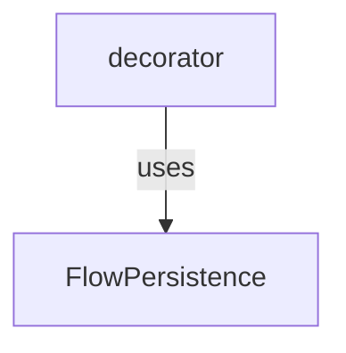

# flow_state_persistence
This module defines an abstract base class for flow state persistence and provides a decorator to automatically integrate persistence into flow classes and methods.

<!-- DIAGRAM_JSON
{
  "nodes": [
    {
      "id": "FlowPersistence",
      "label": "FlowPersistence",
      "description": "Abstract base class for defining flow state persistence interfaces.",
      "type": "class"
    },
    {
      "id": "decorator",
      "label": "decorator",
      "description": "Function decorator to inject and manage flow state persistence for classes and methods.",
      "type": "function"
    }
  ],
  "edges": [
    {
      "source": "decorator",
      "target": "FlowPersistence",
      "label": "uses"
    }
  ],
  "groups": []
}
-->
