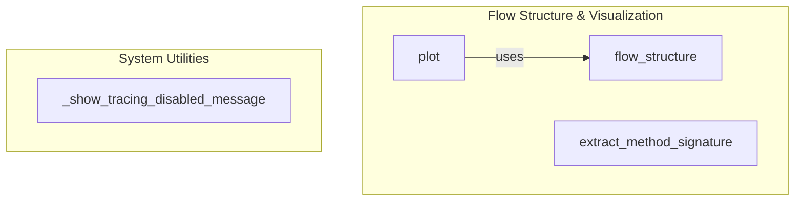

# flow_structure_visualization
This module facilitates the introspection and visualization of CrewAI flow structures, offering tools to extract detailed method signatures and generate interactive HTML diagrams. It also includes a utility for displaying tracing status messages.

<!-- DIAGRAM_JSON
{
  "nodes": [
    {
      "id": "flow_structure",
      "label": "flow_structure",
      "description": "Introspects a Flow class to return its graph structure."
    },
    {
      "id": "plot",
      "label": "plot",
      "description": "Generates an interactive HTML visualization of the Flow structure."
    },
    {
      "id": "extract_method_signature",
      "label": "extract_method_signature",
      "description": "Extracts method signature as OpenAPI schema with documentation."
    },
    {
      "id": "_show_tracing_disabled_message",
      "label": "_show_tracing_disabled_message",
      "description": "Displays a message when tracing is disabled."
    }
  ],
  "edges": [
    {
      "source": "plot",
      "target": "flow_structure",
      "label": "uses"
    }
  ],
  "groups": [
    {
      "id": "flow_visualization",
      "label": "Flow Structure & Visualization",
      "nodes": ["flow_structure", "plot", "extract_method_signature"]
    },
    {
      "id": "system_utilities",
      "label": "System Utilities",
      "nodes": ["_show_tracing_disabled_message"]
    }
  ]
}
-->
