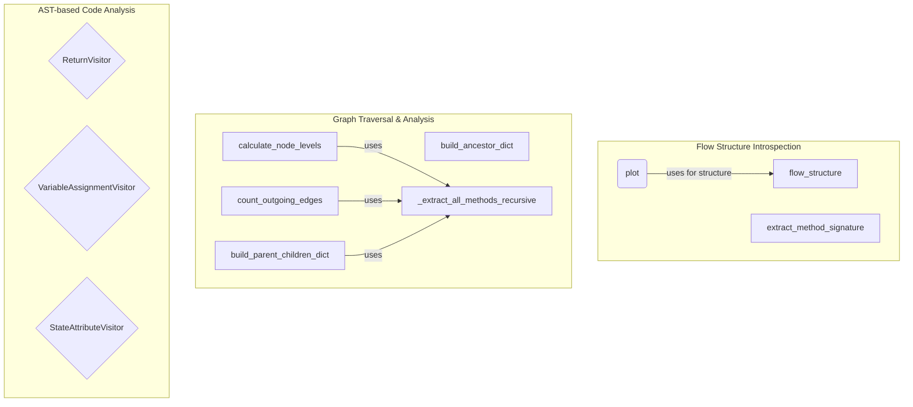

# flow_utilities
Provides utilities for introspecting, analyzing, and visualizing the structure and behavior of CrewAI flows, including graph traversal algorithms and AST-based code analysis.

<!-- DIAGRAM_JSON
{
  "nodes": [
    {"id": "A", "label": "flow_structure", "type": "function"},
    {"id": "B", "label": "plot", "type": "method"},
    {"id": "C", "label": "extract_method_signature", "type": "function"},
    {"id": "D", "label": "build_ancestor_dict", "type": "function"},
    {"id": "E", "label": "calculate_node_levels", "type": "function"},
    {"id": "F", "label": "count_outgoing_edges", "type": "function"},
    {"id": "G", "label": "build_parent_children_dict", "type": "function"},
    {"id": "H", "label": "ReturnVisitor", "type": "class"},
    {"id": "I", "label": "VariableAssignmentVisitor", "type": "class"},
    {"id": "J", "label": "StateAttributeVisitor", "type": "class"},
    {"id": "K", "label": "_extract_all_methods_recursive", "type": "function"}
  ],
  "edges": [
    {"source": "B", "target": "A", "label": "uses for structure"},
    {"source": "E", "target": "K", "label": "uses"},
    {"source": "F", "target": "K", "label": "uses"},
    {"source": "G", "target": "K", "label": "uses"}
  ],
  "groups": [
    {"id": "introspection", "label": "Flow Structure Introspection", "nodes": ["A", "B", "C"]},
    {"id": "graph_analysis", "label": "Graph Traversal & Analysis", "nodes": ["D", "E", "F", "G", "K"]},
    {"id": "ast_analysis", "label": "AST-based Code Analysis", "nodes": ["H", "I", "J"]}
  ]
}
-->
