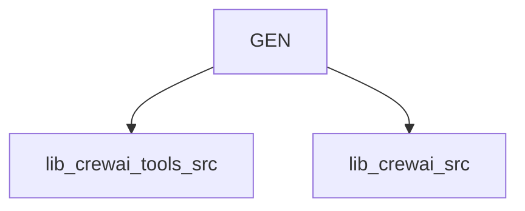

# General Purpose Tools

This module contains 2 sub-modules:

- [lib_crewai_tools_src](lib_crewai_tools_src.md) - 83 components
- [lib_crewai_src](lib_crewai_src.md) - 7 components

## Architecture

