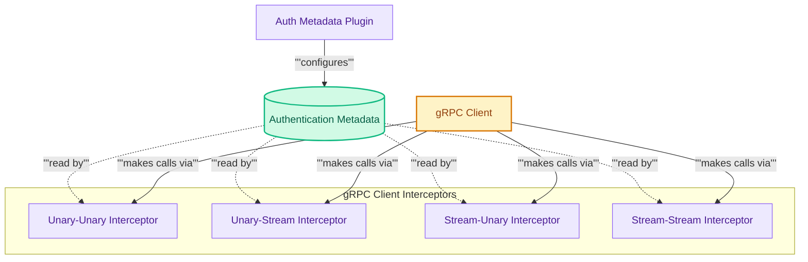

## gRPC Authentication Delegation

This module provides gRPC client interceptors and a metadata plugin to seamlessly inject authentication headers into various types of gRPC calls (unary, stream, and bidirectional), enabling secure communication through metadata delegation.

<!-- DIAGRAM_JSON
{
    "direction": "TD",
    "nodes": [
        {"id": "auth_plugin", "label": "Auth Metadata Plugin", "type": "component", "link": null},
        {"id": "metadata_storage", "label": "Authentication Metadata", "type": "data", "link": null},
        {"id": "grpc_client", "label": "gRPC Client", "type": "external", "link": null},
        {"id": "unary_unary", "label": "Unary-Unary Interceptor", "type": "component", "link": null},
        {"id": "unary_stream", "label": "Unary-Stream Interceptor", "type": "component", "link": null},
        {"id": "stream_unary", "label": "Stream-Unary Interceptor", "type": "component", "link": null},
        {"id": "stream_stream", "label": "Stream-Stream Interceptor", "type": "component", "link": null}
    ],
    "edges": [
        {"source": "auth_plugin", "target": "metadata_storage", "label": "configures"},
        {"source": "metadata_storage", "target": "unary_unary", "label": "read by"},
        {"source": "metadata_storage", "target": "unary_stream", "label": "read by"},
        {"source": "metadata_storage", "target": "stream_unary", "label": "read by"},
        {"source": "metadata_storage", "target": "stream_stream", "label": "read by"},
        {"source": "grpc_client", "target": "unary_unary", "label": "makes calls via"},
        {"source": "grpc_client", "target": "unary_stream", "label": "makes calls via"},
        {"source": "grpc_client", "target": "stream_unary", "label": "makes calls via"},
        {"source": "grpc_client", "target": "stream_stream", "label": "makes calls via"}
    ],
    "groups": [
        {"id": "interceptors_group", "label": "gRPC Client Interceptors", "role": "analytical", "nodes": ["unary_unary", "unary_stream", "stream_unary", "stream_stream"]}
    ]
}
-->
