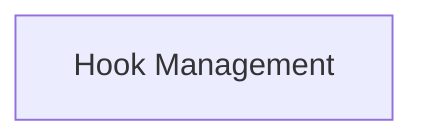

<!-- AUTO_GENERATED_PLACEHOLDER
  reason: LLM did not create .md file for this module
  module_path: crewai_core_framework/eventing_and_context/hook_management
  component_count: 9
  generated_at: 2026-05-07T03:07:02.960229
-->

# Hook Management

Enables the registration and execution of custom logic before and after LLM and tool calls, allowing for custom observability, control, and modification.

<!-- DIAGRAM_JSON
{
    "direction": "TD",
    "nodes": [
        {
            "id": "hook_management",
            "label": "Hook Management",
            "type": "module",
            "title": "Hook Management",
            "description": "Enables the registration and execution of custom logic before and after LLM and tool calls, allowing for custom observability, control, and modification."
        }
    ],
    "edges": [],
    "groups": []
}
-->

