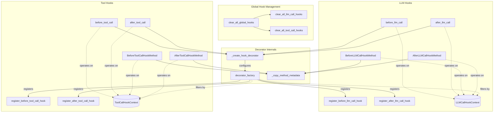

# hooks_and_annotations
This module provides a system for defining and managing various types of hooks (before/after LLM calls, before/after tool calls) using decorators and wrapper classes. It enables custom logic injection and filtering based on agents or tools, and offers global management.

<!-- DIAGRAM_JSON
{
    "nodes": [
        {
            "id": "hooks_and_annotations",
            "label": "hooks_and_annotations",
            "type": "module"
        },
        {
            "id": "F1",
            "label": "clear_all_global_hooks"
        },
        {
            "id": "F2",
            "label": "decorator_factory"
        },
        {
            "id": "F3",
            "label": "before_llm_call"
        },
        {
            "id": "F4",
            "label": "after_llm_call"
        },
        {
            "id": "F5",
            "label": "before_tool_call"
        },
        {
            "id": "F6",
            "label": "after_tool_call"
        },
        {
            "id": "F7",
            "label": "register_before_llm_call_hook"
        },
        {
            "id": "F8",
            "label": "register_after_llm_call_hook"
        },
        {
            "id": "F9",
            "label": "register_before_tool_call_hook"
        },
        {
            "id": "F10",
            "label": "register_after_tool_call_hook"
        },
        {
            "id": "F11",
            "label": "clear_all_llm_call_hooks"
        },
        {
            "id": "F12",
            "label": "clear_all_tool_call_hooks"
        },
        {
            "id": "F13",
            "label": "_create_hook_decorator"
        },
        {
            "id": "F14",
            "label": "_copy_method_metadata"
        },
        {
            "id": "C1",
            "label": "BeforeLLMCallHookMethod"
        },
        {
            "id": "C2",
            "label": "AfterLLMCallHookMethod"
        },
        {
            "id": "C3",
            "label": "BeforeToolCallHookMethod"
        },
        {
            "id": "C4",
            "label": "AfterToolCallHookMethod"
        },
        {
            "id": "D1",
            "label": "LLMCallHookContext"
        },
        {
            "id": "D2",
            "label": "ToolCallHookContext"
        },
        {
            "id": "project_annotations",
            "label": "Project Annotations",
            "type": "module",
            "link": "project_annotations.md"
        },
        {
            "id": "hook_management",
            "label": "Hook Management",
            "type": "module",
            "link": "hook_management.md"
        }
    ],
    "edges": [
        {
            "source": "F1",
            "target": "F11",
            "type": "calls"
        },
        {
            "source": "F1",
            "target": "F12",
            "type": "calls"
        },
        {
            "source": "F3",
            "target": "F13",
            "type": "uses"
        },
        {
            "source": "F4",
            "target": "F13",
            "type": "uses"
        },
        {
            "source": "F5",
            "target": "F13",
            "type": "uses"
        },
        {
            "source": "F6",
            "target": "F13",
            "type": "uses"
        },
        {
            "source": "F13",
            "target": "F2",
            "type": "configures"
        },
        {
            "source": "F2",
            "target": "F7",
            "type": "registers"
        },
        {
            "source": "F2",
            "target": "F8",
            "type": "registers"
        },
        {
            "source": "F2",
            "target": "F9",
            "type": "registers"
        },
        {
            "source": "F2",
            "target": "F10",
            "type": "registers"
        },
        {
            "source": "C1",
            "target": "F14",
            "type": "uses"
        },
        {
            "source": "C2",
            "target": "F14",
            "type": "uses"
        },
        {
            "source": "C3",
            "target": "F14",
            "type": "uses"
        },
        {
            "source": "C4",
            "target": "F14",
            "type": "uses"
        },
        {
            "source": "F3",
            "target": "D1",
            "type": "operates on"
        },
        {
            "source": "F4",
            "target": "D1",
            "type": "operates on"
        },
        {
            "source": "C1",
            "target": "D1",
            "type": "operates on"
        },
        {
            "source": "C2",
            "target": "D1",
            "type": "operates on"
        },
        {
            "source": "F5",
            "target": "D2",
            "type": "operates on"
        },
        {
            "source": "F6",
            "target": "D2",
            "type": "operates on"
        },
        {
            "source": "C3",
            "target": "D2",
            "type": "operates on"
        },
        {
            "source": "C4",
            "target": "D2",
            "type": "operates on"
        },
        {
            "source": "F2",
            "target": "D1",
            "type": "filters by"
        },
        {
            "source": "F2",
            "target": "D2",
            "type": "filters by"
        },
        {
            "source": "hooks_and_annotations",
            "target": "project_annotations"
        },
        {
            "source": "hooks_and_annotations",
            "target": "hook_management"
        }
    ],
    "groups": [
        {
            "id": "global_management",
            "label": "Global Hook Management",
            "nodes": [
                "F1",
                "F11",
                "F12"
            ]
        },
        {
            "id": "llm_hooks",
            "label": "LLM Hooks",
            "nodes": [
                "F3",
                "F4",
                "F7",
                "F8",
                "C1",
                "C2",
                "D1"
            ]
        },
        {
            "id": "tool_hooks",
            "label": "Tool Hooks",
            "nodes": [
                "F5",
                "F6",
                "F9",
                "F10",
                "C3",
                "C4",
                "D2"
            ]
        },
        {
            "id": "decorator_internals",
            "label": "Decorator Internals",
            "nodes": [
                "F2",
                "F13",
                "F14"
            ]
        }
    ]
}
-->
