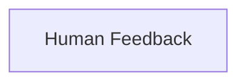

<!-- AUTO_GENERATED_PLACEHOLDER
  reason: LLM did not create .md file for this module
  module_path: crewai_core_framework/tasks_and_flow/human_feedback
  component_count: 2
  generated_at: 2026-05-07T03:07:02.958372
-->

# Human Feedback

Integrates human feedback mechanisms into AI agent flows for dynamic interaction and learning.

<!-- DIAGRAM_JSON
{
    "direction": "TD",
    "nodes": [
        {
            "id": "human_feedback",
            "label": "Human Feedback",
            "type": "module",
            "title": "Human Feedback",
            "description": "Integrates human feedback mechanisms into AI agent flows for dynamic interaction and learning."
        }
    ],
    "edges": [],
    "groups": []
}
-->

