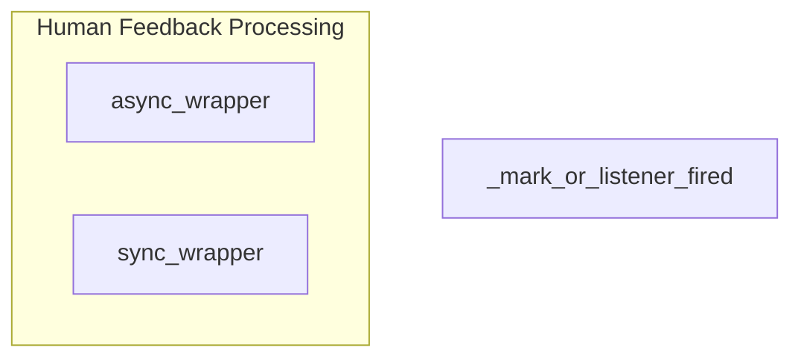

# human_interaction_feedback
This module provides wrappers for integrating human feedback into asynchronous and synchronous flows, enabling pre-review, feedback collection, processing, and lesson distillation. It also includes a utility for managing flow listeners.

<!-- DIAGRAM_JSON
{
  "nodes": [
    {"id": "async_wrapper", "label": "async_wrapper"},
    {"id": "sync_wrapper", "label": "sync_wrapper"},
    {"id": "_mark_or_listener_fired", "label": "_mark_or_listener_fired"}
  ],
  "edges": [],
  "groups": [
    {"id": "human_feedback_processing", "label": "Human Feedback Processing", "nodes": ["async_wrapper", "sync_wrapper"]}
  ]
}
-->
