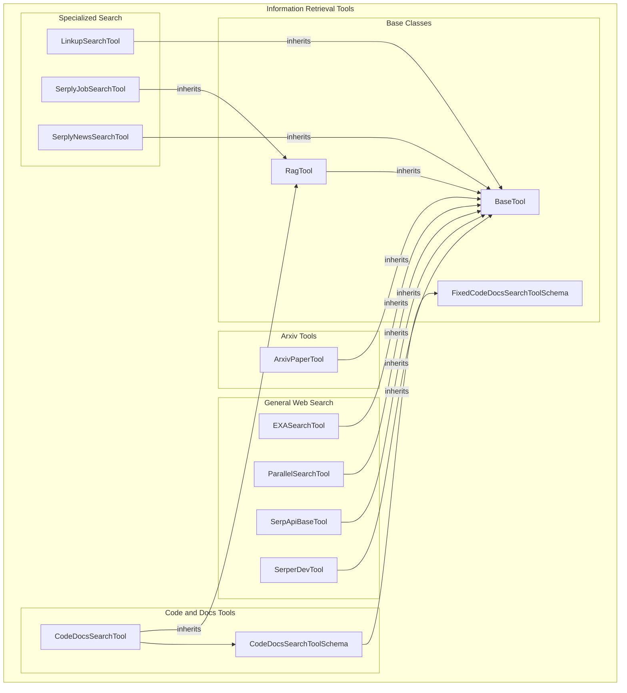

# information_retrieval_tools
This module offers a suite of specialized tools for retrieving and searching information from diverse sources, including academic databases, code documentation, and various web search engines. It provides interfaces for interacting with APIs such as Arxiv, Exa, Linkup, Parallel, SerpApi, and Serper.dev.

<!-- DIAGRAM_JSON
{
  "nodes": [
    {"id": "ArxivPaperTool", "label": "ArxivPaperTool", "type": "class"},
    {"id": "CodeDocsSearchTool", "label": "CodeDocsSearchTool", "type": "class"},
    {"id": "CodeDocsSearchToolSchema", "label": "CodeDocsSearchToolSchema", "type": "schema"},
    {"id": "EXASearchTool", "label": "EXASearchTool", "type": "class"},
    {"id": "LinkupSearchTool", "label": "LinkupSearchTool", "type": "class"},
    {"id": "ParallelSearchTool", "label": "ParallelSearchTool", "type": "class"},
    {"id": "SerpApiBaseTool", "label": "SerpApiBaseTool", "type": "class"},
    {"id": "SerperDevTool", "label": "SerperDevTool", "type": "class"},
    {"id": "SerplyJobSearchTool", "label": "SerplyJobSearchTool", "type": "class"},
    {"id": "SerplyNewsSearchTool", "label": "SerplyNewsSearchTool", "type": "class"},
    {"id": "BaseTool", "label": "BaseTool", "type": "base_class"},
    {"id": "RagTool", "label": "RagTool", "type": "base_class"},
    {"id": "FixedCodeDocsSearchToolSchema", "label": "FixedCodeDocsSearchToolSchema", "type": "base_schema"}
  ],
  "edges": [
    {"source": "ArxivPaperTool", "target": "BaseTool", "type": "inheritance"},
    {"source": "CodeDocsSearchTool", "target": "RagTool", "type": "inheritance"},
    {"source": "CodeDocsSearchTool", "target": "CodeDocsSearchToolSchema", "type": "reference"},
    {"source": "CodeDocsSearchToolSchema", "target": "FixedCodeDocsSearchToolSchema", "type": "inheritance"},
    {"source": "EXASearchTool", "target": "BaseTool", "type": "inheritance"},
    {"source": "LinkupSearchTool", "target": "BaseTool", "type": "inheritance"},
    {"source": "ParallelSearchTool", "target": "BaseTool", "type": "inheritance"},
    {"source": "SerpApiBaseTool", "target": "BaseTool", "type": "inheritance"},
    {"source": "SerperDevTool", "target": "BaseTool", "type": "inheritance"},
    {"source": "SerplyJobSearchTool", "target": "RagTool", "type": "inheritance"},
    {"source": "SerplyNewsSearchTool", "target": "BaseTool", "type": "inheritance"},
    {"source": "RagTool", "target": "BaseTool", "type": "inheritance"}
  ],
  "groups": [
    {
      "id": "information_retrieval_tools",
      "label": "Information Retrieval Tools",
      "nodes": ["ArxivPaperTool", "CodeDocsSearchTool", "CodeDocsSearchToolSchema", "EXASearchTool", "LinkupSearchTool", "ParallelSearchTool", "SerpApiBaseTool", "SerperDevTool", "SerplyJobSearchTool", "SerplyNewsSearchTool", "BaseTool", "RagTool", "FixedCodeDocsSearchToolSchema"]
    },
    {
      "id": "base_classes",
      "label": "Base Classes",
      "nodes": ["BaseTool", "RagTool", "FixedCodeDocsSearchToolSchema"]
    },
    {
      "id": "arxiv_tools",
      "label": "Arxiv Tools",
      "nodes": ["ArxivPaperTool"]
    },
    {
      "id": "code_docs_tools",
      "label": "Code & Docs Tools",
      "nodes": ["CodeDocsSearchTool", "CodeDocsSearchToolSchema"]
    },
    {
      "id": "general_web_search",
      "label": "General Web Search",
      "nodes": ["EXASearchTool", "ParallelSearchTool", "SerpApiBaseTool", "SerperDevTool"]
    },
    {
      "id": "specialized_search",
      "label": "Specialized Search",
      "nodes": ["LinkupSearchTool", "SerplyJobSearchTool", "SerplyNewsSearchTool"]
    }
  ]
}
-->
```
