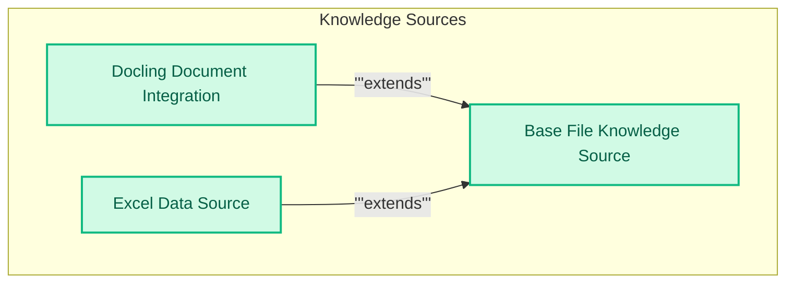

# Knowledge Sources Management
This module provides classes for integrating and managing diverse knowledge sources, including base file handling, multi-format document conversion via Docling, and structured data extraction from Excel files.

<!-- DIAGRAM_JSON
{
    "direction": "TD",
    "nodes": [
        {"id": "base_file_knowledge_source", "label": "Base File Knowledge Source", "type": "module", "link": "base_file_knowledge_source.md"},
        {"id": "docling_integration", "label": "Docling Document Integration", "type": "module", "link": "docling_integration.md"},
        {"id": "excel_data_source", "label": "Excel Data Source", "type": "module", "link": "excel_data_source.md"}
    ],
    "edges": [
        {"source": "docling_integration", "target": "base_file_knowledge_source", "label": "extends"},
        {"source": "excel_data_source", "target": "base_file_knowledge_source", "label": "extends"}
    ],
    "groups": [
        {"id": "knowledge_sources_group", "label": "Knowledge Sources", "role": "data", "nodes": ["base_file_knowledge_source", "docling_integration", "excel_data_source"]}
    ]
}
-->
