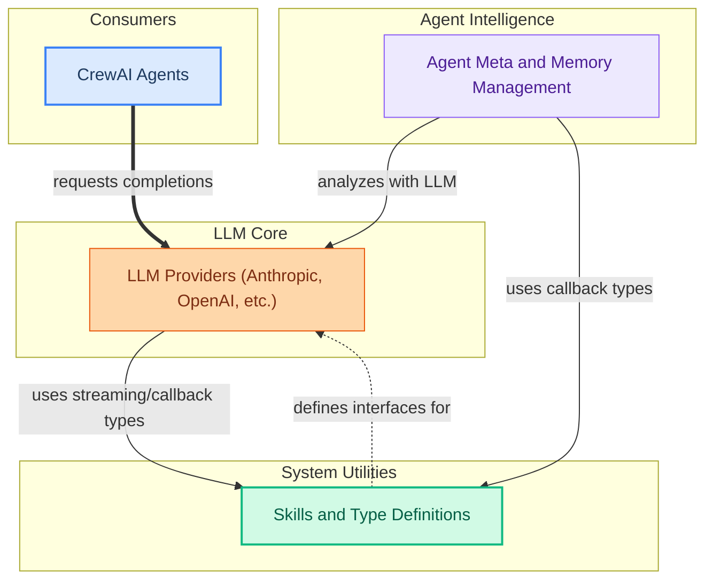

The `language_model_integration` module is the central hub for integrating and managing various Large Language Models (LLMs) within the CrewAI framework. Its primary purpose is to provide a standardized, flexible interface for interacting with different LLM providers, enabling agents to leverage advanced AI capabilities for tasks such as content generation, complex reasoning, and intelligent memory management. It also defines essential types and utilities to ensure seamless data flow and streaming output handling across the system.

### How it Works

The module is structured into three main sub-modules that work in concert:

1.  **LLM Providers**: This sub-module offers concrete implementations for various LLM services (e.g., Anthropic, Azure, Bedrock, Gemini, OpenAI-compatible). It abstracts away the complexities of each provider, presenting a unified `BaseLLM` interface for the rest of the system.
2.  **Agent Meta and Memory Management**: This sub-module empowers agents with dynamic capabilities and intelligent memory. It uses LLMs to analyze and consolidate agent memories, determining their scope and importance, and dynamically extends agent behavior through metaclasses.
3.  **Skills and Type Definitions**: This sub-module provides foundational utilities and type definitions crucial for LLM interactions. It handles the loading of skills, conversion of string representations to callable functions, and defines the structure for streaming outputs, ensuring consistent data handling.

These components collectively allow CrewAI agents to seamlessly interact with diverse LLMs, manage their internal state and knowledge, and process information effectively.

<!-- DIAGRAM_JSON
{
    "direction": "TD",
    "nodes": [
        {
            "id": "language_model_integration",
            "label": "Language Model Integration",
            "type": "module"
        },
        {
            "id": "llm_providers_node",
            "label": "LLM Providers (Anthropic, OpenAI, etc.)",
            "type": "module",
            "link": "llm_providers.md"
        },
        {
            "id": "agent_memory_node",
            "label": "Agent Meta and Memory Management",
            "type": "module",
            "link": "agent_meta_and_memory.md"
        },
        {
            "id": "skills_types_node",
            "label": "Skills and Type Definitions",
            "type": "module",
            "link": "skills_and_types.md"
        },
        {
            "id": "crewai_agents_node",
            "label": "CrewAI Agents",
            "type": "external"
        },
        {
            "id": "llm_providers",
            "label": "llm_providers module",
            "type": "module",
            "link": "llm_providers.md"
        },
        {
            "id": "agent_meta_and_memory",
            "label": "Agent Meta and Memory Management",
            "type": "module",
            "link": "agent_meta_and_memory.md"
        },
        {
            "id": "skills_and_types",
            "label": "Skills and Type Definitions",
            "type": "module",
            "link": "skills_and_types.md"
        }
    ],
    "edges": [
        {
            "source": "crewai_agents_node",
            "target": "llm_providers_node",
            "label": "requests completions"
        },
        {
            "source": "agent_memory_node",
            "target": "llm_providers_node",
            "label": "analyzes with LLM"
        },
        {
            "source": "llm_providers_node",
            "target": "skills_types_node",
            "label": "uses streaming/callback types"
        },
        {
            "source": "agent_memory_node",
            "target": "skills_types_node",
            "label": "uses callback types"
        },
        {
            "source": "skills_types_node",
            "target": "llm_providers_node",
            "label": "defines interfaces for"
        },
        {
            "source": "language_model_integration",
            "target": "llm_providers"
        },
        {
            "source": "language_model_integration",
            "target": "agent_meta_and_memory"
        },
        {
            "source": "language_model_integration",
            "target": "skills_and_types"
        }
    ],
    "groups": [
        {
            "id": "llm_core_group",
            "label": "LLM Core",
            "role": "generative",
            "nodes": [
                "llm_providers_node"
            ]
        },
        {
            "id": "agent_intelligence_group",
            "label": "Agent Intelligence",
            "role": "analytical",
            "nodes": [
                "agent_memory_node"
            ]
        },
        {
            "id": "system_utilities_group",
            "label": "System Utilities",
            "role": "data",
            "nodes": [
                "skills_types_node"
            ]
        },
        {
            "id": "consumers_group",
            "label": "Consumers",
            "role": "surface",
            "nodes": [
                "crewai_agents_node"
            ]
        }
    ]
}
-->

### Core Components Documentation

*   **LLM Providers**:
    *   `lib.crewai.src.crewai.llms.base_llm.BaseLLM`
    *   `lib.crewai.src.crewai.llms.providers.anthropic.completion.AnthropicCompletion`
    *   `lib.crewai.src.crewai.llms.providers.azure.completion.AzureCompletion`
    *   `lib.crewai.src.crewai.llms.providers.bedrock.completion.BedrockCompletion`
    *   `lib.crewai.src.crewai.llms.providers.gemini.completion.GeminiCompletion`
    *   `lib.crewai.src.crewai.llms.providers.openai_compatible.completion.OpenAICompatibleCompletion`
*   **Agent Meta and Memory Management**:
    *   `lib.crewai.src.crewai.agent.internal.meta.AgentMeta`
    *   `lib.crewai.src.crewai.memory.analyze.analyze_for_save`
    *   `lib.crewai.src.crewai.memory.analyze.analyze_for_consolidation`
*   **Skills and Type Definitions**:
    *   `lib.crewai.src.crewai.skills.loader.load_resources`
    *   `lib.crewai.src.crewai.types.callback.string_to_callable`
    *   `lib.crewai.src.crewai.types.streaming.StreamingOutputBase`