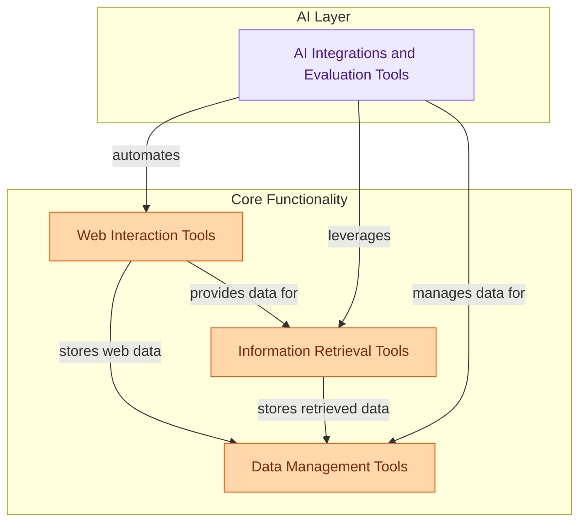

# CrewAI Tools Module
This module provides a comprehensive suite of tools for CrewAI agents, enabling diverse functionalities such as web interaction, information retrieval, data management, and integrations with various AI services and platforms.

<!-- DIAGRAM_JSON
{
    "direction": "TB",
    "nodes": [
        {"id": "web_interaction_tools", "label": "Web Interaction Tools", "type": "module", "link": "web_interaction_tools.md"},
        {"id": "information_retrieval_tools", "label": "Information Retrieval Tools", "type": "module", "link": "information_retrieval_tools.md"},
        {"id": "data_management_tools", "label": "Data Management Tools", "type": "module", "link": "data_management_tools.md"},
        {"id": "ai_integrations_and_evaluation_tools", "label": "AI Integrations and Evaluation Tools", "type": "module", "link": "ai_integrations_and_evaluation_tools.md"}
    ],
    "edges": [
        {"source": "web_interaction_tools", "target": "information_retrieval_tools", "label": "provides data for"},
        {"source": "web_interaction_tools", "target": "data_management_tools", "label": "stores web data"},
        {"source": "information_retrieval_tools", "target": "data_management_tools", "label": "stores retrieved data"},
        {"source": "ai_integrations_and_evaluation_tools", "target": "information_retrieval_tools", "label": "leverages"},
        {"source": "ai_integrations_and_evaluation_tools", "target": "web_interaction_tools", "label": "automates"},
        {"source": "ai_integrations_and_evaluation_tools", "target": "data_management_tools", "label": "manages data for"}
    ],
    "groups": [
        {"id": "core_functionality", "label": "Core Functionality", "role": "generative", "nodes": ["web_interaction_tools", "information_retrieval_tools", "data_management_tools"]},
        {"id": "ai_layer", "label": "AI Layer", "role": "analytical", "nodes": ["ai_integrations_and_evaluation_tools"]}
    ]
}
-->
