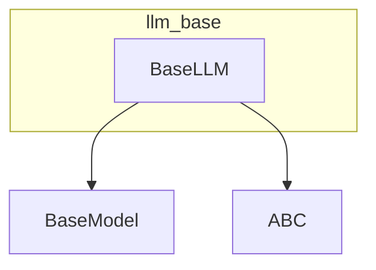

# llm_base
This module defines `BaseLLM`, an abstract base class for custom Large Language Model implementations, providing a standardized interface for various LLM providers.

<!-- DIAGRAM_JSON
{
  "nodes": [
    {
      "id": "BaseLLM",
      "label": "BaseLLM",
      "type": "class",
      "path": "lib.crewai.src.crewai.llms.base_llm.BaseLLM"
    },
    {
      "id": "BaseModel",
      "label": "BaseModel",
      "type": "class",
      "path": "pydantic.BaseModel"
    },
    {
      "id": "ABC",
      "label": "ABC",
      "type": "class",
      "path": "abc.ABC"
    }
  ],
  "edges": [
    {
      "source": "BaseLLM",
      "target": "BaseModel",
      "type": "inherits"
    },
    {
      "source": "BaseLLM",
      "target": "ABC",
      "type": "inherits"
    }
  ],
  "groups": [
    {
      "id": "llm_base",
      "label": "llm_base",
      "members": ["BaseLLM"]
    }
  ]
}
-->
