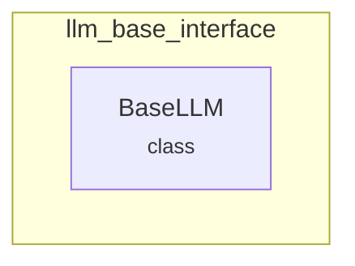

# llm_base_interface
This module provides the `BaseLLM` abstract base class, defining the core interface for all LLM implementations within the system. It allows for custom LLM solutions beyond standard integrations.

<!-- DIAGRAM_JSON
{
  "nodes": [
    {
      "id": "BaseLLM",
      "label": "BaseLLM",
      "type": "class",
      "path": "lib.crewai.src.crewai.llms.base_llm.BaseLLM"
    }
  ],
  "edges": [],
  "groups": [
    {
      "id": "llm_base_interface",
      "label": "llm_base_interface",
      "path": "llm_base_interface",
      "contains": [
        "BaseLLM"
      ]
    }
  ]
}
-->
