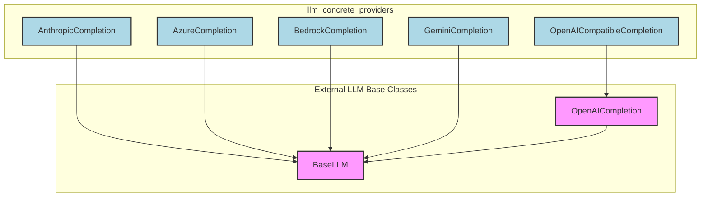

# llm_concrete_providers
This module provides concrete implementations for various Large Language Model (LLM) providers, including Anthropic, Azure, AWS Bedrock, Google Gemini, and OpenAI-compatible services. Each class integrates directly with its respective SDK, offering native features.

<!-- DIAGRAM_JSON
{
  "nodes": [
    {"id": "AnthropicCompletion", "label": "AnthropicCompletion", "description": "Anthropic native completion implementation."},
    {"id": "AzureCompletion", "label": "AzureCompletion", "description": "Azure AI Inference native completion implementation."},
    {"id": "BedrockCompletion", "label": "BedrockCompletion", "description": "AWS Bedrock native completion implementation using the Converse API."},
    {"id": "GeminiCompletion", "label": "GeminiCompletion", "description": "Google Gemini native completion implementation."},
    {"id": "OpenAICompatibleCompletion", "label": "OpenAICompatibleCompletion", "description": "OpenAI-compatible completion implementation."},
    {"id": "OpenAICompletion", "label": "OpenAICompletion", "description": "Base class for OpenAI completions."},
    {"id": "BaseLLM", "label": "BaseLLM", "description": "Abstract base class for LLM providers."}
  ],
  "edges": [
    {"source": "AnthropicCompletion", "target": "BaseLLM", "type": "inherits"},
    {"source": "AzureCompletion", "target": "BaseLLM", "type": "inherits"},
    {"source": "BedrockCompletion", "target": "BaseLLM", "type": "inherits"},
    {"source": "GeminiCompletion", "target": "BaseLLM", "type": "inherits"},
    {"source": "OpenAICompatibleCompletion", "target": "OpenAICompletion", "type": "inherits"},
    {"source": "OpenAICompletion", "target": "BaseLLM", "type": "inherits"}
  ],
  "groups": [
    {"id": "llm_concrete_providers", "label": "llm_concrete_providers", "nodes": ["AnthropicCompletion", "AzureCompletion", "BedrockCompletion", "GeminiCompletion", "OpenAICompatibleCompletion"]},
    {"id": "external_base_classes", "label": "External LLM Base Classes", "nodes": ["OpenAICompletion", "BaseLLM"]}
  ]
}
-->
