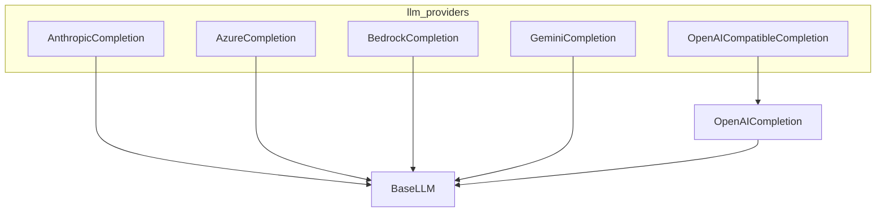

# llm_providers module
This module defines various Large Language Model (LLM) provider implementations, all extending a common `BaseLLM` interface to offer native integration with different AI services. It includes specialized classes for Anthropic, Azure, Bedrock, Gemini, and OpenAI-compatible LLMs.

<!-- DIAGRAM_JSON
{
    "nodes": [
        {
            "id": "BaseLLM",
            "label": "BaseLLM"
        },
        {
            "id": "AnthropicCompletion",
            "label": "AnthropicCompletion"
        },
        {
            "id": "AzureCompletion",
            "label": "AzureCompletion"
        },
        {
            "id": "BedrockCompletion",
            "label": "BedrockCompletion"
        },
        {
            "id": "GeminiCompletion",
            "label": "GeminiCompletion"
        },
        {
            "id": "OpenAICompletion",
            "label": "OpenAICompletion"
        },
        {
            "id": "OpenAICompatibleCompletion",
            "label": "OpenAICompatibleCompletion"
        }
    ],
    "edges": [
        {
            "source": "AnthropicCompletion",
            "target": "BaseLLM",
            "label": "inherits"
        },
        {
            "source": "AzureCompletion",
            "target": "BaseLLM",
            "label": "inherits"
        },
        {
            "source": "BedrockCompletion",
            "target": "BaseLLM",
            "label": "inherits"
        },
        {
            "source": "GeminiCompletion",
            "target": "BaseLLM",
            "label": "inherits"
        },
        {
            "source": "OpenAICompletion",
            "target": "BaseLLM",
            "label": "inherits"
        },
        {
            "source": "OpenAICompatibleCompletion",
            "target": "OpenAICompletion",
            "label": "inherits"
        }
    ],
    "groups": [
        {
            "id": "llm_providers",
            "label": "llm_providers",
            "nodes": [
                "AnthropicCompletion",
                "AzureCompletion",
                "BedrockCompletion",
                "GeminiCompletion",
                "OpenAICompatibleCompletion"
            ]
        }
    ]
}
-->
