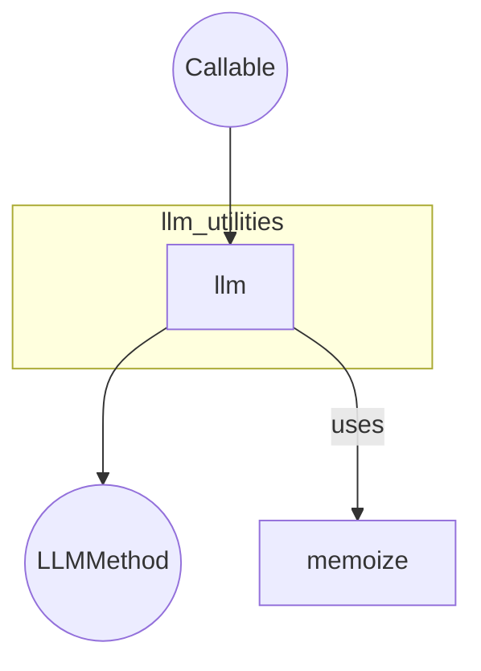

# llm_utilities
A utility module providing a decorator to mark methods as LLM providers. It automatically applies memoization to these methods for efficient and consistent LLM interactions.

<!-- DIAGRAM_JSON
{
  "nodes": [
    {"id": "llm", "label": "llm", "type": "function"},
    {"id": "Callable", "label": "Callable", "type": "type"},
    {"id": "LLMMethod", "label": "LLMMethod", "type": "type"},
    {"id": "memoize", "label": "memoize", "type": "function"}
  ],
  "edges": [
    {"source": "Callable", "target": "llm", "label": "input"},
    {"source": "llm", "target": "LLMMethod", "label": "returns"},
    {"source": "llm", "target": "memoize", "label": "uses"}
  ],
  "groups": [
    {"id": "llm_utilities_module", "label": "llm_utilities", "nodes": ["llm"]}
  ]
}
-->
