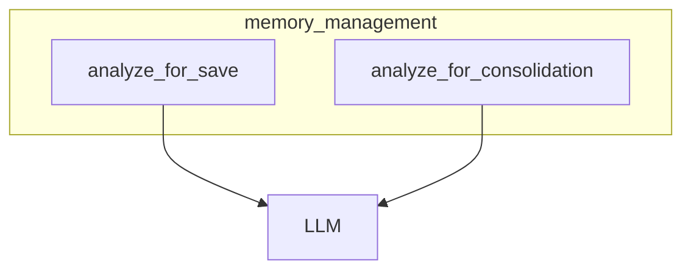

# memory_management
This module provides core memory analysis functionalities. It includes functions for inferring metadata for new memories and for generating consolidation plans against existing records, both leveraging an LLM.

<!-- DIAGRAM_JSON
{
  "nodes": [
    {
      "id": "analyze_for_save",
      "label": "analyze_for_save"
    },
    {
      "id": "analyze_for_consolidation",
      "label": "analyze_for_consolidation"
    },
    {
      "id": "LLM",
      "label": "LLM"
    }
  ],
  "edges": [
    {
      "source": "analyze_for_save",
      "target": "LLM"
    },
    {
      "source": "analyze_for_consolidation",
      "target": "LLM"
    }
  ],
  "groups": [
    {
      "id": "memory_management",
      "label": "memory_management",
      "contains": [
        "analyze_for_save",
        "analyze_for_consolidation"
      ]
    }
  ]
}
-->
