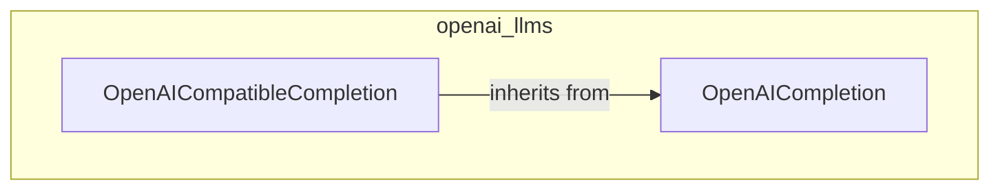

# openai_llms
This module provides classes for interacting with OpenAI's native completion APIs and various OpenAI-compatible LLM providers. It includes `OpenAICompletion` for direct OpenAI integration and `OpenAICompatibleCompletion` for other providers.

<!-- DIAGRAM_JSON
{
  "nodes": [
    {
      "id": "OpenAICompletion",
      "label": "OpenAICompletion",
      "path": "lib.crewai.src.crewai.llms.providers.openai.completion.OpenAICompletion"
    },
    {
      "id": "OpenAICompatibleCompletion",
      "label": "OpenAICompatibleCompletion",
      "path": "lib.crewai.src.crewai.llms.providers.openai_compatible.completion.OpenAICompatibleCompletion"
    }
  ],
  "edges": [
    {
      "source": "OpenAICompatibleCompletion",
      "target": "OpenAICompletion",
      "type": "inherits"
    }
  ],
  "groups": [
    {
      "id": "openai_llms",
      "label": "openai_llms",
      "members": [
        "OpenAICompletion",
        "OpenAICompatibleCompletion"
      ]
    }
  ]
}
-->
