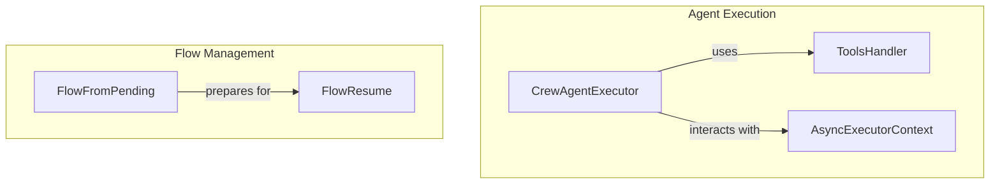

# part_1
This module defines core components for agent execution and flow management, including an agent executor, a tool handler, an asynchronous executor context, and methods for resuming and restoring execution flows.

<!-- DIAGRAM_JSON
{
    "nodes": [
        {
            "id": "part_1",
            "label": "part_1",
            "type": "module"
        },
        {
            "id": "A",
            "label": "CrewAgentExecutor"
        },
        {
            "id": "B",
            "label": "ToolsHandler"
        },
        {
            "id": "C",
            "label": "AsyncExecutorContext"
        },
        {
            "id": "D",
            "label": "FlowResume"
        },
        {
            "id": "E",
            "label": "FlowFromPending"
        },
        {
            "id": "aws_bedrock_integrations",
            "label": "AWS Bedrock Integrations",
            "type": "module",
            "link": "aws_bedrock_integrations.md"
        },
        {
            "id": "database_query_tools",
            "label": "Database Query Tools",
            "type": "module",
            "link": "database_query_tools.md"
        },
        {
            "id": "document_and_file_search",
            "label": "Document and File Search",
            "type": "module",
            "link": "document_and_file_search.md"
        },
        {
            "id": "crew_ai_platform_tool",
            "label": "CrewAI Platform Action",
            "type": "module",
            "link": "crew_ai_platform_tool.md"
        },
        {
            "id": "web_search_and_scraping",
            "label": "Web Search and Scraping",
            "type": "module",
            "link": "web_search_and_scraping.md"
        },
        {
            "id": "ai_agent_and_execution",
            "label": "AI Agent and Code Execution Tools",
            "type": "module",
            "link": "ai_agent_and_execution.md"
        }
    ],
    "edges": [
        {
            "source": "A",
            "target": "B",
            "label": "uses"
        },
        {
            "source": "A",
            "target": "C",
            "label": "interacts with"
        },
        {
            "source": "E",
            "target": "D",
            "label": "prepares for"
        },
        {
            "source": "part_1",
            "target": "aws_bedrock_integrations"
        },
        {
            "source": "part_1",
            "target": "database_query_tools"
        },
        {
            "source": "part_1",
            "target": "document_and_file_search"
        },
        {
            "source": "part_1",
            "target": "crew_ai_platform_tool"
        },
        {
            "source": "part_1",
            "target": "web_search_and_scraping"
        },
        {
            "source": "part_1",
            "target": "ai_agent_and_execution"
        }
    ],
    "groups": [
        {
            "id": "G1",
            "label": "Agent Execution",
            "nodes": [
                "A",
                "B",
                "C"
            ]
        },
        {
            "id": "G2",
            "label": "Flow Management",
            "nodes": [
                "D",
                "E"
            ]
        }
    ]
}
-->
