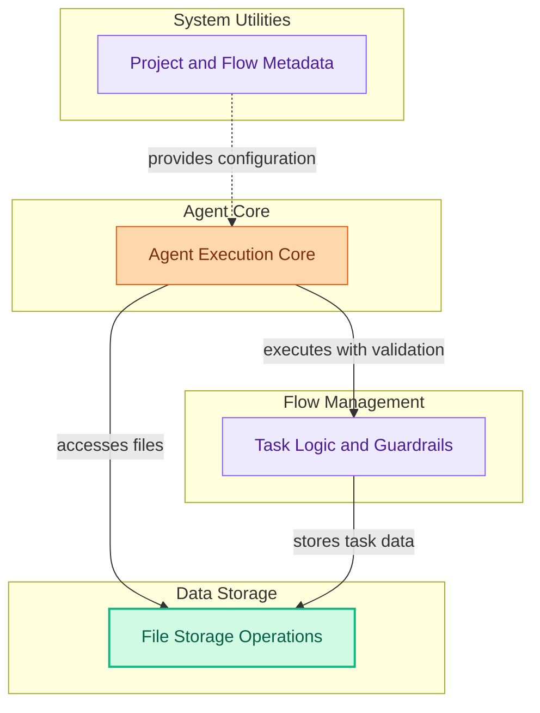

# Module 10: Advanced Agent and Task Management
This module encompasses core agent execution logic, conditional tasking, guardrails for output validation, project-level metadata handling, and file storage utilities.

<!-- DIAGRAM_JSON
{
    "direction": "TD",
    "nodes": [
        {
            "id": "agent_execution",
            "label": "Agent Execution Core",
            "type": "module",
            "link": "agent_execution.md"
        },
        {
            "id": "task_logic_and_guardrails",
            "label": "Task Logic and Guardrails",
            "type": "module",
            "link": "task_logic_and_guardrails.md"
        },
        {
            "id": "project_and_flow_metadata",
            "label": "Project and Flow Metadata",
            "type": "module",
            "link": "project_and_flow_metadata.md"
        },
        {
            "id": "file_store_operations",
            "label": "File Storage Operations",
            "type": "module",
            "link": "file_store_operations.md"
        }
    ],
    "edges": [
        {
            "source": "agent_execution",
            "target": "task_logic_and_guardrails",
            "label": "executes with validation"
        },
        {
            "source": "agent_execution",
            "target": "file_store_operations",
            "label": "accesses files"
        },
        {
            "source": "project_and_flow_metadata",
            "target": "agent_execution",
            "label": "provides configuration"
        },
        {
            "source": "task_logic_and_guardrails",
            "target": "file_store_operations",
            "label": "stores task data"
        }
    ],
    "groups": [
        {
            "id": "agent_core",
            "label": "Agent Core",
            "role": "generative",
            "nodes": [
                "agent_execution"
            ]
        },
        {
            "id": "flow_management",
            "label": "Flow Management",
            "role": "analytical",
            "nodes": [
                "task_logic_and_guardrails"
            ]
        },
        {
            "id": "data_storage",
            "label": "Data Storage",
            "role": "data",
            "nodes": [
                "file_store_operations"
            ]
        },
        {
            "id": "system_utilities",
            "label": "System Utilities",
            "role": "analytical",
            "nodes": [
                "project_and_flow_metadata"
            ]
        }
    ]
}
-->
