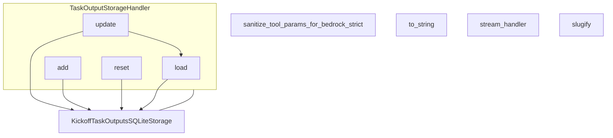

# part_11
The `part_11` module provides a collection of utility functions for data sanitization, serialization, string manipulation, and stream handling, alongside a class for managing task output storage.

<!-- DIAGRAM_JSON
{
    "nodes": [
        {
            "id": "part_11",
            "label": "part_11",
            "type": "module"
        },
        {
            "id": "sanitize_tool_params_for_bedrock_strict",
            "label": "sanitize_tool_params_for_bedrock_strict",
            "type": "function"
        },
        {
            "id": "to_string",
            "label": "to_string",
            "type": "function"
        },
        {
            "id": "stream_handler",
            "label": "stream_handler",
            "type": "function"
        },
        {
            "id": "slugify",
            "label": "slugify",
            "type": "function"
        },
        {
            "id": "TaskOutputStorageHandler_class",
            "label": "TaskOutputStorageHandler",
            "type": "class"
        },
        {
            "id": "TaskOutputStorageHandler_update",
            "label": "update",
            "type": "method"
        },
        {
            "id": "TaskOutputStorageHandler_add",
            "label": "add",
            "type": "method"
        },
        {
            "id": "TaskOutputStorageHandler_reset",
            "label": "reset",
            "type": "method"
        },
        {
            "id": "TaskOutputStorageHandler_load",
            "label": "load",
            "type": "method"
        },
        {
            "id": "KickoffTaskOutputsSQLiteStorage",
            "label": "KickoffTaskOutputsSQLiteStorage",
            "type": "external"
        },
        {
            "id": "specialized_handlers",
            "label": "Specialized Utility Handlers",
            "type": "module",
            "link": "specialized_handlers.md"
        },
        {
            "id": "serialization_and_string_utils",
            "label": "Serialization and String Utilities",
            "type": "module",
            "link": "serialization_and_string_utils.md"
        }
    ],
    "edges": [
        {
            "source": "TaskOutputStorageHandler_update",
            "target": "TaskOutputStorageHandler_load"
        },
        {
            "source": "TaskOutputStorageHandler_update",
            "target": "KickoffTaskOutputsSQLiteStorage"
        },
        {
            "source": "TaskOutputStorageHandler_add",
            "target": "KickoffTaskOutputsSQLiteStorage"
        },
        {
            "source": "TaskOutputStorageHandler_reset",
            "target": "KickoffTaskOutputsSQLiteStorage"
        },
        {
            "source": "TaskOutputStorageHandler_load",
            "target": "KickoffTaskOutputsSQLiteStorage"
        },
        {
            "source": "TaskOutputStorageHandler_update",
            "target": "KickoffTaskOutputsSQLiteStorage",
            "label": "uses"
        },
        {
            "source": "part_11",
            "target": "specialized_handlers"
        },
        {
            "source": "part_11",
            "target": "serialization_and_string_utils"
        }
    ],
    "groups": [
        {
            "id": "TaskOutputStorageHandler_class__group",
            "label": "TaskOutputStorageHandler",
            "nodes": [
                "TaskOutputStorageHandler_update",
                "TaskOutputStorageHandler_add",
                "TaskOutputStorageHandler_reset",
                "TaskOutputStorageHandler_load"
            ],
            "_repaired": "r4_group_renamed_avoid_node_collision"
        }
    ]
}
-->
```
