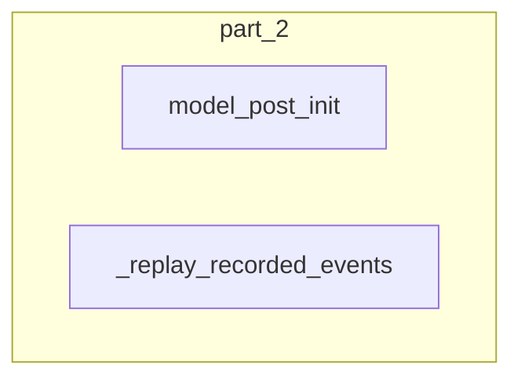

# part_2
The `part_2` module contains methods for post-initialization of a flow and for replaying recorded method execution events to restore state or dispatch actions.

<!-- DIAGRAM_JSON
{
    "direction": "TD",
    "nodes": [
        {
            "id": "part_2",
            "label": "Part 2",
            "type": "module"
        },
        {
            "id": "c0",
            "label": "FileCompressorTool",
            "type": "component"
        },
        {
            "id": "c1",
            "label": "FirecrawlCrawlWebsiteTool",
            "type": "component"
        },
        {
            "id": "c2",
            "label": "FirecrawlScrapeWebsiteTool",
            "type": "component"
        },
        {
            "id": "c3",
            "label": "FirecrawlSearchTool",
            "type": "component"
        },
        {
            "id": "c4",
            "label": "GenerateCrewaiAutomationTool",
            "type": "component"
        },
        {
            "id": "more",
            "label": "+49 more",
            "type": "component"
        }
    ],
    "edges": [
        {
            "source": "part_2",
            "target": "c0"
        },
        {
            "source": "part_2",
            "target": "c1"
        },
        {
            "source": "part_2",
            "target": "c2"
        },
        {
            "source": "part_2",
            "target": "c3"
        },
        {
            "source": "part_2",
            "target": "c4"
        },
        {
            "source": "part_2",
            "target": "more"
        }
    ],
    "groups": [],
    "_auto_generated": true
}
-->
