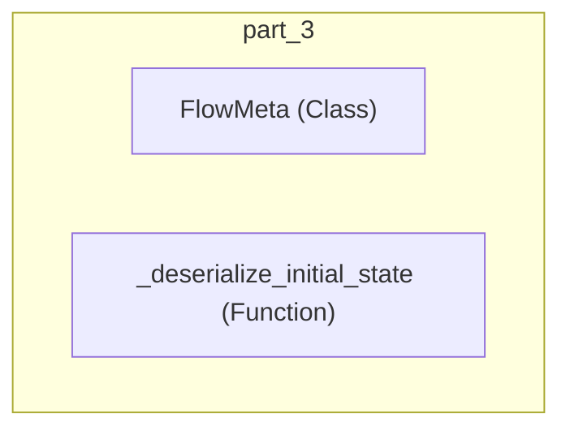

# part_3
This module defines `FlowMeta`, a metaclass for managing flow-related attributes, and `_deserialize_initial_state`, a utility for rehydrating serialized class references.

<!-- DIAGRAM_JSON
{
    "nodes": [
        {
            "id": "FlowMeta",
            "label": "FlowMeta",
            "type": "class"
        },
        {
            "id": "_deserialize_initial_state",
            "label": "_deserialize_initial_state",
            "type": "function"
        }
    ],
    "edges": [],
    "groups": [
        {
            "id": "part_3",
            "label": "part_3",
            "nodes": [
                "FlowMeta",
                "_deserialize_initial_state"
            ]
        }
    ]
}
-->
