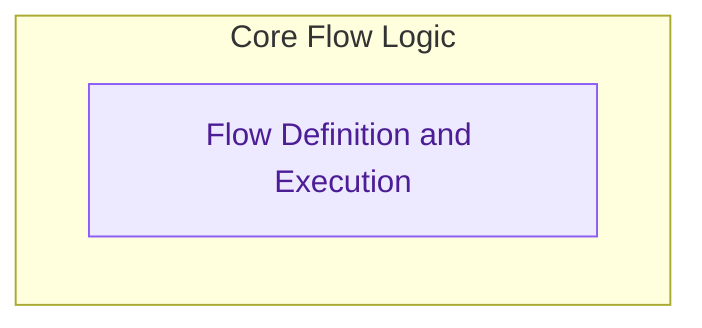

# Flow Definition and Management

This module defines the `Flow` class, which serves as the core orchestration engine for CrewAI. It handles the lifecycle of a flow, managing state, method execution, human feedback, and persistence mechanisms to ensure robust and interactive agent workflows.

<!-- DIAGRAM_JSON
{
    "direction": "TD",
    "nodes": [
        {
            "id": "part_4",
            "label": "Flow Definition and Management",
            "type": "module"
        },
        {
            "id": "flow_definition_and_execution",
            "label": "Flow Definition and Execution",
            "type": "module",
            "link": "flow_definition_and_execution.md"
        }
    ],
    "edges": [],
    "groups": [
        {
            "id": "core_flow_logic",
            "label": "Core Flow Logic",
            "role": "analytical",
            "nodes": [
                "flow_definition_and_execution"
            ]
        }
    ]
}
-->

