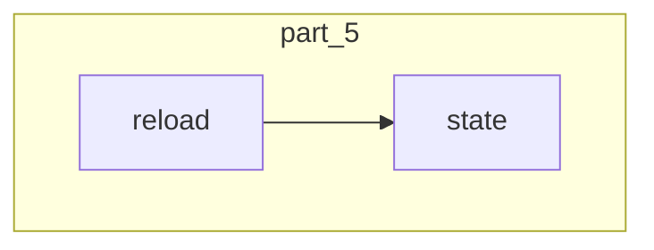

# part_5
This module manages the operational state of a flow, providing methods to access its current state and to reload it from execution data. It ensures flow continuity by restoring execution progress and internal state.

<!-- DIAGRAM_JSON
{
    "nodes": [
        {
            "id": "part_5",
            "label": "part_5",
            "type": "module"
        },
        {
            "id": "state_node",
            "label": "state"
        },
        {
            "id": "reload_node",
            "label": "reload"
        },
        {
            "id": "flow_state_management",
            "label": "Flow State Management",
            "type": "module",
            "link": "flow_state_management.md"
        }
    ],
    "edges": [
        {
            "source": "reload_node",
            "target": "state_node"
        },
        {
            "source": "part_5",
            "target": "flow_state_management"
        }
    ],
    "groups": [
        {
            "id": "part_5_group",
            "label": "part_5",
            "nodes": [
                "state_node",
                "reload_node"
            ]
        }
    ]
}
-->
