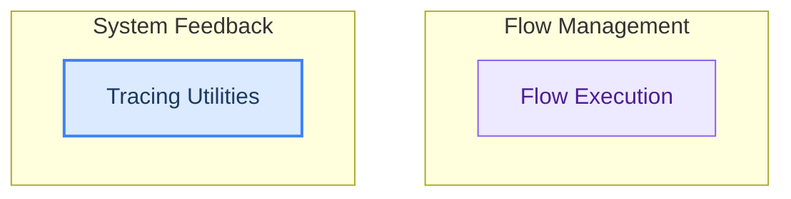

# Flow Execution and Tracing
This module manages the asynchronous execution of operational flows, handling results and errors, and provides utilities for informing users about tracing status and how to enable it for better visibility.

<!-- DIAGRAM_JSON
{
    "direction": "TD",
    "nodes": [
        {
            "id": "part_6",
            "label": "Flow Execution and Tracing",
            "type": "module"
        },
        {
            "id": "flow_execution",
            "label": "Flow Execution",
            "type": "module",
            "link": "flow_execution.md"
        },
        {
            "id": "tracing_utilities",
            "label": "Tracing Utilities",
            "type": "module",
            "link": "tracing_utilities.md"
        }
    ],
    "edges": [],
    "groups": [
        {
            "id": "flow_management",
            "label": "Flow Management",
            "role": "analytical",
            "nodes": [
                "flow_execution"
            ]
        },
        {
            "id": "system_feedback",
            "label": "System Feedback",
            "role": "surface",
            "nodes": [
                "tracing_utilities"
            ]
        }
    ]
}
-->

