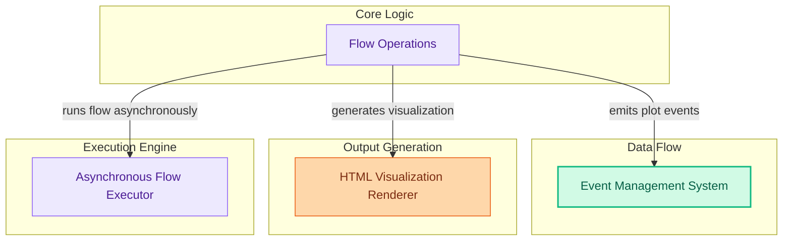

# Flow Execution and Visualization
This module provides core functionalities for asynchronously executing agent flows and generating interactive visualizations of their underlying structure, enabling better understanding and debugging.

<!-- DIAGRAM_JSON
{
    "direction": "TD",
    "nodes": [
        {
            "id": "part_7",
            "label": "Flow Execution and Visualization",
            "type": "module"
        },
        {
            "id": "flow_ops",
            "label": "Flow Operations",
            "type": "module",
            "link": "flow_execution_and_visualization.md"
        },
        {
            "id": "event_system",
            "label": "Event Management System",
            "type": "external"
        },
        {
            "id": "html_renderer",
            "label": "HTML Visualization Renderer",
            "type": "external"
        },
        {
            "id": "async_executor",
            "label": "Asynchronous Flow Executor",
            "type": "external"
        },
        {
            "id": "flow_execution_and_visualization",
            "label": "Flow Execution and Visualization",
            "type": "module",
            "link": "flow_execution_and_visualization.md"
        }
    ],
    "edges": [
        {
            "source": "flow_ops",
            "target": "event_system",
            "label": "emits plot events"
        },
        {
            "source": "flow_ops",
            "target": "html_renderer",
            "label": "generates visualization"
        },
        {
            "source": "flow_ops",
            "target": "async_executor",
            "label": "runs flow asynchronously"
        },
        {
            "source": "part_7",
            "target": "flow_execution_and_visualization"
        }
    ],
    "groups": [
        {
            "id": "core_logic",
            "label": "Core Logic",
            "role": "analytical",
            "nodes": [
                "flow_ops"
            ]
        },
        {
            "id": "data_flow",
            "label": "Data Flow",
            "role": "data",
            "nodes": [
                "event_system"
            ]
        },
        {
            "id": "output_gen",
            "label": "Output Generation",
            "role": "generative",
            "nodes": [
                "html_renderer"
            ]
        },
        {
            "id": "execution",
            "label": "Execution Engine",
            "role": "analytical",
            "nodes": [
                "async_executor"
            ]
        }
    ]
}
-->
