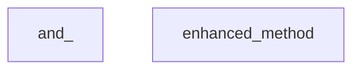

# part_8
This module defines `and_`, a utility for combining flow control conditions, and `enhanced_method`, a snippet likely used for method wrapping and argument preparation.

<!-- DIAGRAM_JSON
{
    "nodes": [
        {
            "id": "and_",
            "label": "and_"
        },
        {
            "id": "enhanced_method",
            "label": "enhanced_method"
        }
    ],
    "edges": [],
    "groups": []
}
-->

