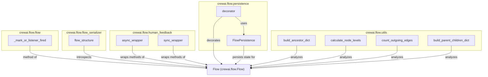

# part_9
This module encompasses core flow management, serialization, human feedback mechanisms, persistence, and utility functions for analyzing flow structures within the CrewAI framework.

<!-- DIAGRAM_JSON
{
    "nodes": [
        {
            "id": "MarkListenerFired",
            "label": "_mark_or_listener_fired"
        },
        {
            "id": "FlowStructure",
            "label": "flow_structure"
        },
        {
            "id": "AsyncFeedbackWrapper",
            "label": "async_wrapper"
        },
        {
            "id": "SyncFeedbackWrapper",
            "label": "sync_wrapper"
        },
        {
            "id": "FlowPersistence",
            "label": "FlowPersistence"
        },
        {
            "id": "PersistenceDecorator",
            "label": "decorator"
        },
        {
            "id": "BuildAncestorDict",
            "label": "build_ancestor_dict"
        },
        {
            "id": "CalculateNodeLevels",
            "label": "calculate_node_levels"
        },
        {
            "id": "CountOutgoingEdges",
            "label": "count_outgoing_edges"
        },
        {
            "id": "BuildParentChildrenDict",
            "label": "build_parent_children_dict"
        },
        {
            "id": "Flow",
            "label": "Flow (crewai.flow.Flow)"
        }
    ],
    "edges": [
        {
            "source": "MarkListenerFired",
            "target": "Flow",
            "label": "method of"
        },
        {
            "source": "FlowStructure",
            "target": "Flow",
            "label": "introspects"
        },
        {
            "source": "AsyncFeedbackWrapper",
            "target": "Flow",
            "label": "wraps methods of"
        },
        {
            "source": "SyncFeedbackWrapper",
            "target": "Flow",
            "label": "wraps methods of"
        },
        {
            "source": "PersistenceDecorator",
            "target": "Flow",
            "label": "decorates"
        },
        {
            "source": "PersistenceDecorator",
            "target": "FlowPersistence",
            "label": "uses"
        },
        {
            "source": "FlowPersistence",
            "target": "Flow",
            "label": "persists state for"
        },
        {
            "source": "BuildAncestorDict",
            "target": "Flow",
            "label": "analyzes"
        },
        {
            "source": "CalculateNodeLevels",
            "target": "Flow",
            "label": "analyzes"
        },
        {
            "source": "CountOutgoingEdges",
            "target": "Flow",
            "label": "analyzes"
        },
        {
            "source": "BuildParentChildrenDict",
            "target": "Flow",
            "label": "analyzes"
        }
    ],
    "groups": [
        {
            "id": "FlowCore",
            "label": "crewai.flow.flow",
            "nodes": [
                "MarkListenerFired"
            ]
        },
        {
            "id": "FlowSerialization",
            "label": "crewai.flow.flow_serializer",
            "nodes": [
                "FlowStructure"
            ]
        },
        {
            "id": "HumanFeedback",
            "label": "crewai.flow.human_feedback",
            "nodes": [
                "AsyncFeedbackWrapper",
                "SyncFeedbackWrapper"
            ]
        },
        {
            "id": "FlowPersistenceGroup",
            "label": "crewai.flow.persistence",
            "nodes": [
                "FlowPersistence",
                "PersistenceDecorator"
            ]
        },
        {
            "id": "FlowUtilities",
            "label": "crewai.flow.utils",
            "nodes": [
                "BuildAncestorDict",
                "CalculateNodeLevels",
                "CountOutgoingEdges",
                "BuildParentChildrenDict"
            ]
        }
    ]
}
-->
