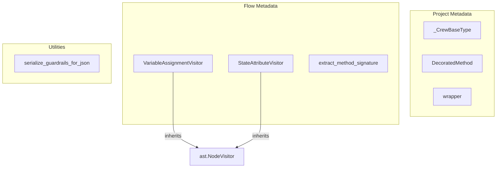

# project_and_flow_metadata
This module provides components for extracting and managing metadata related to project structure and execution flow, including method decoration, AST analysis for variable and state attributes, and serialization utilities.

<!-- DIAGRAM_JSON
{
  "nodes": [
    {"id": "A", "label": "_CrewBaseType", "type": "class"},
    {"id": "B", "label": "DecoratedMethod", "type": "class"},
    {"id": "C", "label": "wrapper", "type": "function"},
    {"id": "D", "label": "VariableAssignmentVisitor", "type": "class"},
    {"id": "E", "label": "StateAttributeVisitor", "type": "class"},
    {"id": "F", "label": "extract_method_signature", "type": "function"},
    {"id": "G", "label": "serialize_guardrails_for_json", "type": "function"}
  ],
  "edges": [
    {"from": "D", "to": "ast.NodeVisitor", "label": "extends"},
    {"from": "E", "to": "ast.NodeVisitor", "label": "extends"}
  ],
  "groups": [
    {"id": "project_metadata", "label": "Project Metadata", "nodes": ["A", "B", "C"]},
    {"id": "flow_metadata", "label": "Flow Metadata", "nodes": ["D", "E", "F"]},
    {"id": "utilities", "label": "Utilities", "nodes": ["G"]}
  ]
}
-->
