# Project Annotations
This module provides decorators to annotate methods and classes, defining core crew components like tasks, agents, and LLMs, along with lifecycle hooks and output formats, which are then processed by the central crew setup wrapper.

<!-- DIAGRAM_JSON
{
    "direction": "TD",
    "nodes": [
        {
            "id": "task_ann",
            "label": "@task (define crew task)",
            "type": "component"
        },
        {
            "id": "agent_ann",
            "label": "@agent (define crew agent)",
            "type": "component"
        },
        {
            "id": "llm_ann",
            "label": "@llm (define LLM provider)",
            "type": "component"
        },
        {
            "id": "tool_ann",
            "label": "@tool (define crew tool)",
            "type": "component"
        },
        {
            "id": "cache_ann",
            "label": "@cache_handler (define cache handler)",
            "type": "component"
        },
        {
            "id": "before_kickoff_ann",
            "label": "@before_kickoff (define pre-run hook)",
            "type": "component"
        },
        {
            "id": "after_kickoff_ann",
            "label": "@after_kickoff (define post-run hook)",
            "type": "component"
        },
        {
            "id": "output_json_ann",
            "label": "@output_json (define JSON output)",
            "type": "component"
        },
        {
            "id": "output_pydantic_ann",
            "label": "@output_pydantic (define Pydantic output)",
            "type": "component"
        },
        {
            "id": "crew_wrapper",
            "label": "Crew Setup Wrapper (orchestrates)",
            "type": "component"
        },
        {
            "id": "configured_crew",
            "label": "Configured Crew Instance",
            "type": "component"
        },
        {
            "id": "hook_module",
            "label": "Hook Management Module",
            "type": "external",
            "link": "hook_management.md"
        }
    ],
    "edges": [
        {
            "source": "task_ann",
            "target": "crew_wrapper",
            "label": "registers task"
        },
        {
            "source": "agent_ann",
            "target": "crew_wrapper",
            "label": "registers agent"
        },
        {
            "source": "llm_ann",
            "target": "crew_wrapper",
            "label": "registers LLM"
        },
        {
            "source": "tool_ann",
            "target": "crew_wrapper",
            "label": "registers tool"
        },
        {
            "source": "cache_ann",
            "target": "crew_wrapper",
            "label": "registers cache handler"
        },
        {
            "source": "before_kickoff_ann",
            "target": "crew_wrapper",
            "label": "registers pre-kickoff hook"
        },
        {
            "source": "after_kickoff_ann",
            "target": "crew_wrapper",
            "label": "registers post-kickoff hook"
        },
        {
            "source": "output_json_ann",
            "target": "crew_wrapper",
            "label": "configures output format"
        },
        {
            "source": "output_pydantic_ann",
            "target": "crew_wrapper",
            "label": "configures output format"
        },
        {
            "source": "crew_wrapper",
            "target": "configured_crew",
            "label": "produces"
        },
        {
            "source": "crew_wrapper",
            "target": "hook_module",
            "label": "uses callbacks from"
        }
    ],
    "groups": [
        {
            "id": "component_definitions",
            "label": "Core Component Definitions",
            "role": "generative",
            "nodes": [
                "task_ann",
                "agent_ann",
                "llm_ann",
                "tool_ann",
                "cache_ann"
            ]
        },
        {
            "id": "lifecycle_hooks",
            "label": "Lifecycle Hooks",
            "role": "generative",
            "nodes": [
                "before_kickoff_ann",
                "after_kickoff_ann"
            ]
        },
        {
            "id": "output_formats",
            "label": "Output Format Annotations",
            "role": "generative",
            "nodes": [
                "output_json_ann",
                "output_pydantic_ann"
            ]
        },
        {
            "id": "orchestration_flow",
            "label": "Orchestration Flow",
            "role": "analytical",
            "nodes": [
                "crew_wrapper",
                "configured_crew"
            ]
        }
    ]
}
-->

```mermaid
flowchart TD
    subgraph component_definitions["Core Component Definitions"]
        task_ann["@task (define crew task)"]
        agent_ann["@agent (define crew agent)"]
        llm_ann["@llm (define LLM provider)"]
        tool_ann["@tool (define crew tool)"]
        cache_ann["@cache_handler (define cache handler)"]
    end

    subgraph lifecycle_hooks["Lifecycle Hooks"]
        before_kickoff_ann["@before_kickoff (define pre-run hook)"]
        after_kickoff_ann["@after_kickoff (define post-run hook)"]
    end

    subgraph output_formats["Output Format Annotations"]
        output_json_ann["@output_json (define JSON output)"]
        output_pydantic_ann["@output_pydantic (define Pydantic output)"]
    end

    subgraph orchestration_flow["Orchestration Flow"]
        crew_wrapper["Crew Setup Wrapper (orchestrates)"]
        configured_crew["Configured Crew Instance"]
    end

    hook_module["Hook Management Module"]

    task_ann -->|"registers task"| crew_wrapper
    agent_ann -->|"registers agent"| crew_wrapper
    llm_ann -->|"registers LLM"| crew_wrapper
    tool_ann -->|"registers tool"| crew_wrapper
    cache_ann -->|"registers cache handler"| crew_wrapper
    before_kickoff_ann -->|"registers pre-kickoff hook"| crew_wrapper
    after_kickoff_ann -->|"registers post-run hook"| crew_wrapper
    output_json_ann -->|"configures output format"| crew_wrapper
    output_pydantic_ann -->|"configures output format"| crew_wrapper
    crew_wrapper ==>|"produces"| configured_crew
    crew_wrapper -.->|"uses callbacks from"| hook_module

    classDef generative fill:#fed7aa,stroke:#ea580c,stroke-width:1px,color:#7c2d12
    classDef analytical fill:#ede9fe,stroke:#8b5cf6,stroke-width:1px,color:#4c1d95

    class task_ann,agent_ann,llm_ann,tool_ann,cache_ann,before_kickoff_ann,after_kickoff_ann,output_json_ann,output_pydantic_ann generative
    class crew_wrapper,configured_crew analytical
```
