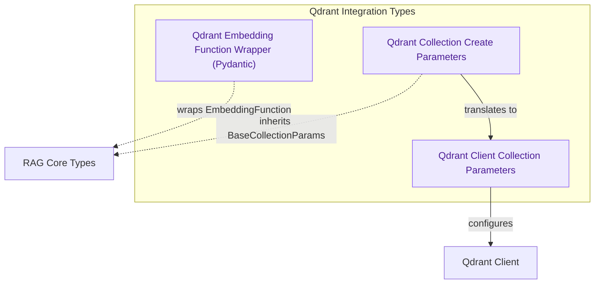

# Qdrant Integration
This module provides data structures and type wrappers for seamless integration with the Qdrant vector database, enabling the definition of Qdrant collections and the handling of embedding functions with Pydantic validation.

<!-- DIAGRAM_JSON
{
    "direction": "TD",
    "nodes": [
        {"id": "qdrant_embed_wrapper", "label": "Qdrant Embedding Function Wrapper (Pydantic)", "type": "component", "link": null},
        {"id": "qdrant_collection_create_params", "label": "Qdrant Collection Create Parameters", "type": "component", "link": null},
        {"id": "create_collection_params", "label": "Qdrant Client Collection Parameters", "type": "component", "link": null},
        {"id": "rag_core_types", "label": "RAG Core Types", "type": "external", "link": "rag_core_types.md"},
        {"id": "qdrant_client", "label": "Qdrant Client", "type": "external", "link": null}
    ],
    "edges": [
        {"source": "qdrant_embed_wrapper", "target": "rag_core_types", "label": "wraps EmbeddingFunction"},
        {"source": "qdrant_collection_create_params", "target": "rag_core_types", "label": "inherits BaseCollectionParams"},
        {"source": "qdrant_collection_create_params", "target": "create_collection_params", "label": "translates to"},
        {"source": "create_collection_params", "target": "qdrant_client", "label": "configures"}
    ],
    "groups": [
        {"id": "qdrant_integration_types", "label": "Qdrant Integration Types", "role": "analytical", "nodes": ["qdrant_embed_wrapper", "qdrant_collection_create_params", "create_collection_params"]}
    ]
}
-->
