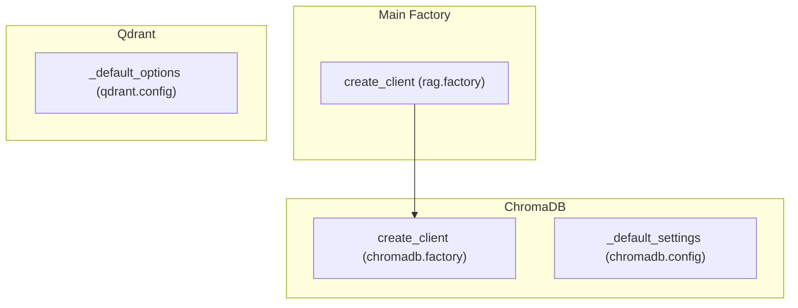

# rag_client_factories
This module provides factories for creating RAG clients, including a main dispatcher and specific implementations for ChromaDB, along with default configuration settings for ChromaDB and Qdrant.

<!-- DIAGRAM_JSON
{
  "nodes": [
    {"id": "main_factory_client", "label": "create_client", "description": "Main RAG client factory (rag.factory)"},
    {"id": "chromadb_factory_client", "label": "create_client", "description": "ChromaDB client factory (chromadb.factory)"},
    {"id": "chromadb_default_settings", "label": "_default_settings", "description": "Default ChromaDB settings (chromadb.config)"},
    {"id": "qdrant_default_options", "label": "_default_options", "description": "Default Qdrant client options (qdrant.config)"}
  ],
  "edges": [
    {"source": "main_factory_client", "target": "chromadb_factory_client", "label": "calls"}
  ],
  "groups": [
    {"id": "main_factory", "label": "Main Factory", "nodes": ["main_factory_client"]},
    {"id": "chromadb", "label": "ChromaDB", "nodes": ["chromadb_factory_client", "chromadb_default_settings"]},
    {"id": "qdrant", "label": "Qdrant", "nodes": ["qdrant_default_options"]}
  ]
}
-->
