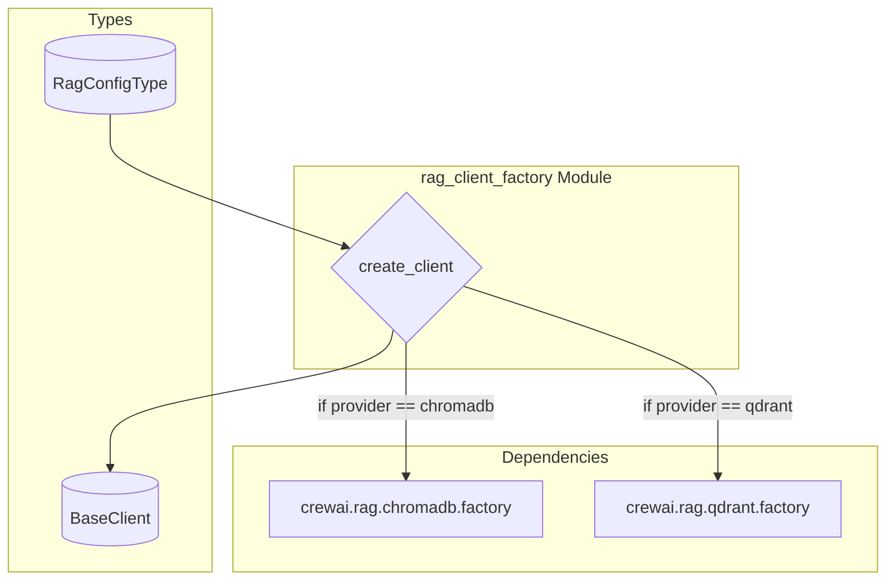

# rag_client_factory
Dynamically creates RAG client instances based on the provided configuration, supporting various vector database providers like ChromaDB and Qdrant.

<!-- DIAGRAM_JSON
{
    "nodes": [
        {
            "id": "create_client",
            "label": "create_client",
            "type": "function"
        },
        {
            "id": "chromadb_factory",
            "label": "crewai.rag.chromadb.factory",
            "type": "module"
        },
        {
            "id": "qdrant_factory",
            "label": "crewai.rag.qdrant.factory",
            "type": "module"
        },
        {
            "id": "RagConfigType",
            "label": "RagConfigType",
            "type": "type"
        },
        {
            "id": "BaseClient",
            "label": "BaseClient",
            "type": "type"
        }
    ],
    "edges": [
        {
            "source": "RagConfigType",
            "target": "create_client",
            "label": "input"
        },
        {
            "source": "create_client",
            "target": "BaseClient",
            "label": "returns"
        },
        {
            "source": "create_client",
            "target": "chromadb_factory",
            "label": "calls (chromadb)"
        },
        {
            "source": "create_client",
            "target": "qdrant_factory",
            "label": "calls (qdrant)"
        }
    ],
    "groups": [
        {
            "id": "rag_client_factory_module",
            "label": "rag_client_factory Module",
            "nodes": [
                "create_client"
            ]
        },
        {
            "id": "dependencies",
            "label": "Dependencies",
            "nodes": [
                "chromadb_factory",
                "qdrant_factory"
            ]
        },
        {
            "id": "types",
            "label": "Types",
            "nodes": [
                "RagConfigType",
                "BaseClient"
            ]
        }
    ]
}
-->
