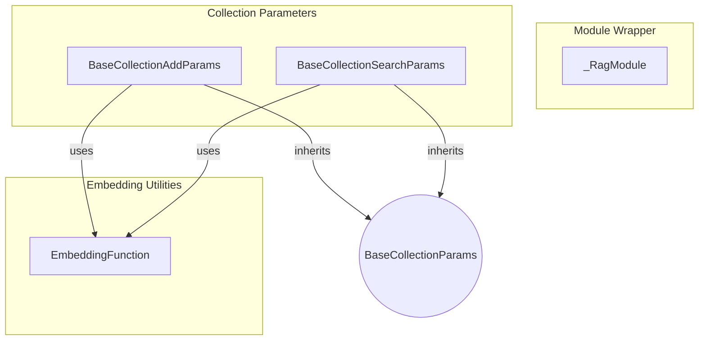

# rag_core Module
The `rag_core` module provides foundational components for Retrieval Augmented Generation (RAG) systems, including collection parameter definitions, an embedding function protocol, and a module configuration wrapper.

<!-- DIAGRAM_JSON
{
    "nodes": [
        {
            "id": "RagModule",
            "label": "_RagModule",
            "type": "class"
        },
        {
            "id": "AddParams",
            "label": "BaseCollectionAddParams",
            "type": "class"
        },
        {
            "id": "SearchParams",
            "label": "BaseCollectionSearchParams",
            "type": "class"
        },
        {
            "id": "EmbedFunc",
            "label": "EmbeddingFunction",
            "type": "protocol"
        },
        {
            "id": "BaseParams",
            "label": "BaseCollectionParams",
            "type": "abstract"
        }
    ],
    "edges": [
        {
            "source": "AddParams",
            "target": "BaseParams",
            "type": "inheritance"
        },
        {
            "source": "SearchParams",
            "target": "BaseParams",
            "type": "inheritance"
        },
        {
            "source": "AddParams",
            "target": "EmbedFunc",
            "type": "uses"
        },
        {
            "source": "SearchParams",
            "target": "EmbedFunc",
            "type": "uses"
        }
    ],
    "groups": [
        {
            "id": "rag_core_components",
            "label": "rag_core Components",
            "nodes": [
                "RagModule",
                "AddParams",
                "SearchParams",
                "EmbedFunc"
            ]
        },
        {
            "id": "module_wrapper",
            "label": "Module Wrapper",
            "nodes": [
                "RagModule"
            ]
        },
        {
            "id": "collection_params",
            "label": "Collection Parameters",
            "nodes": [
                "AddParams",
                "SearchParams"
            ]
        },
        {
            "id": "embedding_utils",
            "label": "Embedding Utilities",
            "nodes": [
                "EmbedFunc"
            ]
        }
    ]
}
-->
